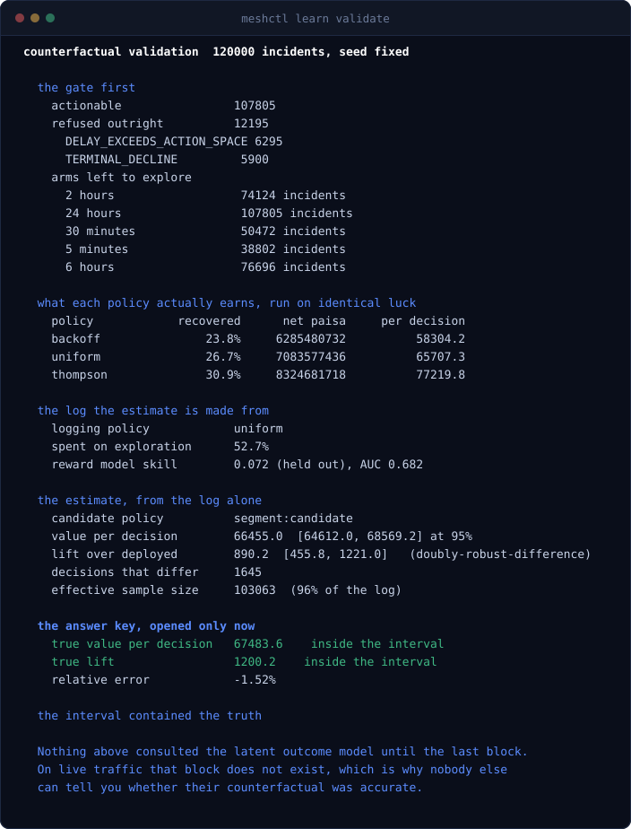
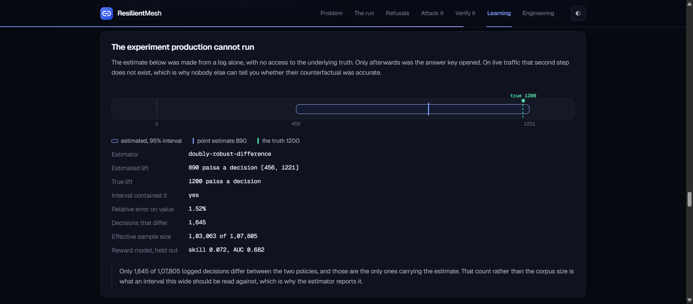
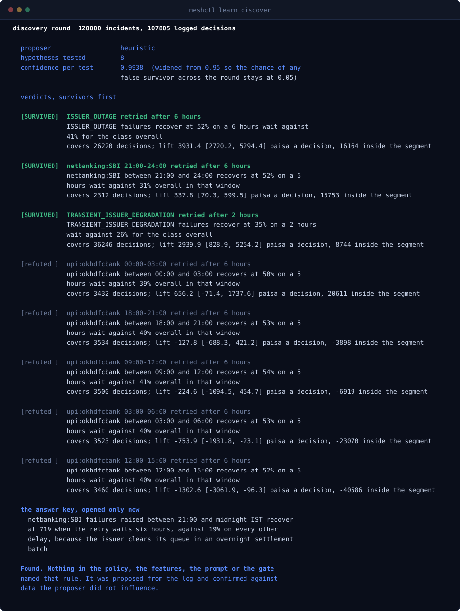
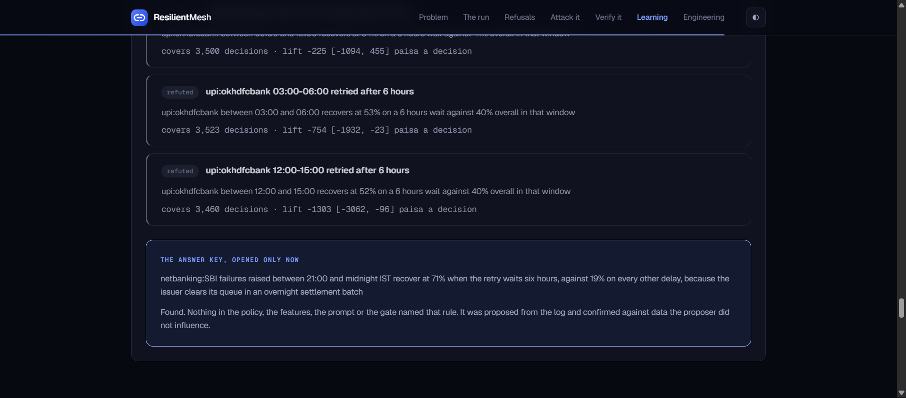
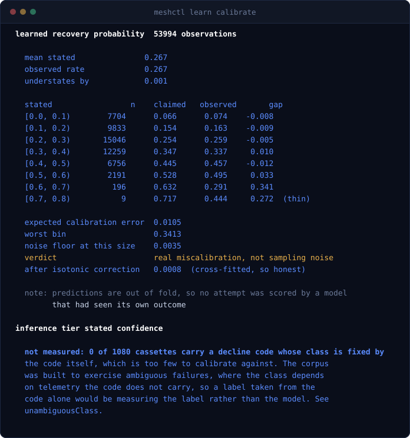
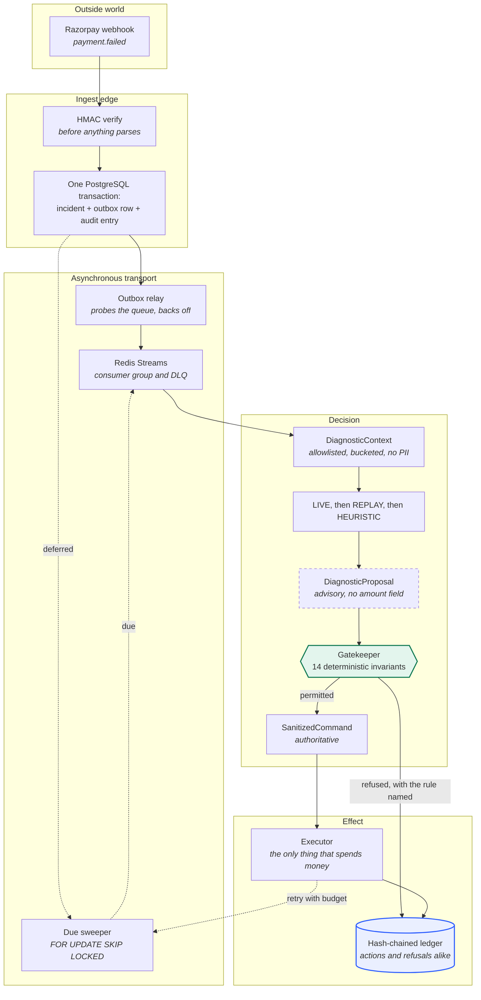
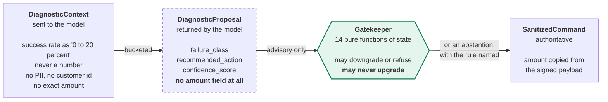
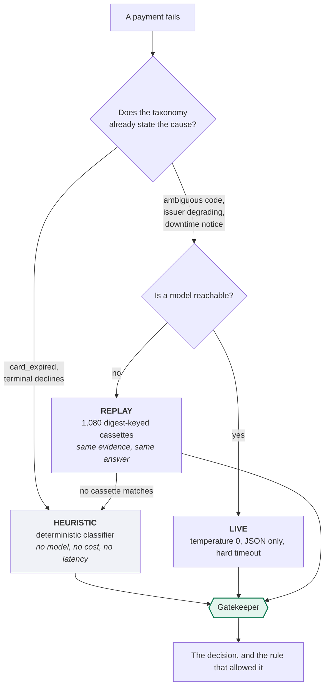

<div align="center">


# ResilientMesh

**A failed payment is a decision, not a retry.**

A recovery system that learns, bounded by rules that were checked exhaustively rather than
tested, writing down enough at the moment of each decision that anyone can later work out
what a *different* policy would have earned on the same traffic, without spending a rupee to
find out.

The model may say what it thinks went wrong and where it thinks the money is hiding. It may
never decide what happens next, never name an amount, and never move a rupee. Every action it
takes, and every action it refuses, comes out as a proof you can check without trusting the
system that produced it.

[](https://go.dev)
[](LICENSE)
[](#proof-not-assertion)
[](#the-fourteen-invariants)
[](#learning-and-proving-the-learning-was-real)
[](#dependencies)

[](https://huggingface.co/spaces/hriday29/resilientmesh)

### Four ways to evaluate this

| | | |
|---|---|---|
| **Attack it** | **[huggingface.co/spaces/hriday29/resilientmesh](https://huggingface.co/spaces/hriday29/resilientmesh)** | The real gatekeeper, compiled to WebAssembly. Send it proposals no model would produce and watch fourteen invariants refuse them, **in your browser**, with no server involved. |
| **Verify it** | same page | Re-derives every audit digest, then proves one payment on its own with a handful of sibling hashes instead of the whole ledger. Both run on your machine. |
| **Falsify it** | `go run ./cmd/meshctl learn validate` | Estimates what a policy that was never executed would have earned, from a log alone, then **opens the answer key** and reports whether the interval was right. No database, no key, no network. |
| **Run it** | `go run ./cmd/meshdemo` | The whole system, two minutes. No Docker, no account, no key. |

[Evaluation guide](docs/EVALUATING.md)
·
[Post-mortem](docs/POSTMORTEM.md)
·
[Live evidence page](https://huggingface.co/spaces/hriday29/resilientmesh)

</div>

---

## Run it in one command

Go 1.25 or newer is the only prerequisite. No Docker, no cloud account, no payment
credentials, no API key.

```bash
git clone https://github.com/vighriday/ResilientMesh-Razorpaybuildathon
cd ResilientMesh-Razorpaybuildathon
go run ./cmd/meshdemo
```

That starts embedded PostgreSQL 18.3 and a Redis-protocol server **inside the process**,
boots the real API and worker, drives a scripted bank outage through them, and narrates what
is happening while every number is read back out of the database. It finishes in about two
minutes and writes a transcript to `artifacts/DEMO_REPORT.md`.

<details>
<summary><b>What that run actually prints</b> (real output, trimmed)</summary>

```
  0. Booting the real system
  · Starting embedded PostgreSQL 18.3 and an in-process Redis server
  · Initialising an empty database, so this run depends on nothing before it
  ✓ Up in 28.8s. API on 127.0.0.1:8080, Razorpay API on 127.0.0.1:8081

  1. A bank goes down and failed payments start arriving
     PAYMENT             ISSUER           DECLINE                  AMOUNT        STATE
     pay_XD0nBPG9aT3YHf  netbanking:SBIN  authentication_failed    ₹6,829.00     ABSTAINED
     pay_nLuP6TRLhYUFTx  netbanking:HDFC  bank_technical_error     ₹3,494.00     RECOVERED
     pay_bDEHVc295COswR  card:ICIC        gateway_technical_error  ₹1,52,574.00  EXECUTING

  2. What the model proposes, and what the gatekeeper allows
       WEBHOOK_ACCEPTED     invalid_otp, ₹939.00, signature verified
       DIAGNOSIS_PROPOSED   LIVE proposed ASYNC_EXPONENTIAL_RETRY at 0.78
       GATE_DECISION        MANDATE_COMPLIANT_CASCADE on card after 86400s
                            [AMOUNT_PINNED RBI_MANDATE_COOLING RBI_PRE_DEBIT_NOTICE DELAY_BOUNDS]
  Decided by LIVE 13   HEURISTIC 118

  3. The decisions it refuses to make
     INVARIANT               TIMES FIRED  WHAT IT PREVENTS
     TERMINAL_DECLINE        12           a decline no retry can fix, so no fee is spent
     AMOUNT_PINNED           10           the amount can only come from the signed payload
     DELAY_BOUNDS            10           the schedule stays inside a sane horizon
     RBI_AFA_CEILING          3           above the ceiling a debit needs authentication
     RBI_MANDATE_COOLING      3           RBI's 24-hour gap between recurring debits
     RBI_PRE_DEBIT_NOTICE     3           the payer must be warned before a debit
     LOW_CONFIDENCE_ABSTAIN   1           the model was not sure enough to spend money

  5. The audit ledger, and an attack on it
  ✓ Chain intact: 538 entries verified, head e61cea979b8ca13d...
  · Editing entry 269 directly in PostgreSQL, as an attacker with database access would
  ✓ Detected at entry 269, the exact row that was edited
```

</details>

<div align="center">

<br><em>The <a href="https://huggingface.co/spaces/hriday29/resilientmesh">evidence page</a> replays this run's own incidents through the real architecture. Each one branches at the gate the way it actually branched.</em>
</div>

---

## What is real, and what is simulated

Stated first, because a recovery system that overstates its own numbers has failed at the
thing it exists to do.

| Real | Simulated |
|---|---|
| **The system.** Embedded PostgreSQL, Redis Streams, the outbox relay, the worker, the gatekeeper and the executor are the production code paths, not a demo build. | **The payments.** Traffic comes from a Razorpay simulator that serves Razorpay's schemas, signs real HMAC webhooks and emits real decline codes against real Indian issuer codes. No customer, and no rupee, is real. |
| **Every decision**, and the rule that permitted or refused it. | **Therefore every money figure is simulated money.** It is summed honestly from the `attempts` table, and it measures the policy rather than a merchant's actual revenue. |
| **The audit ledger** and its SHA-256 hash chain. | **The clock.** Waits before a scheduled retry are compressed so the loop closes while you watch. Regulatory delays are never compressed, and the factor is recorded in the ledger. |
| **The LIVE inference calls**, over the network, at temperature 0. | |
| **Every count, amount and timestamp**, read from the running system's own database. | **The world the estimator is scored against.** `meshctl learn` generates a corpus whose latent structure is known, because scoring a counterfactual needs an answer key and production has none. The method and its accuracy are real; the traffic is not. |
| **The learning**: propensities are committed to the production ledger before each attempt runs, and the worker chooses its delay through the same learner. | |

---

## Why this, and not a sixth recovery agent

Razorpay's Agent Studio already ships Subscription Recovery, Revenue Drop Detector,
Auto-Capture, RTO Shielder and Dispute Auto Responder. Building a seventh variation of those
would be building the part that is already solved.

The unsolved part is the one that stops any of them from being shipped to a regulated Indian
merchant:

> "Your agent retried my customer's mandate. Prove it was allowed to, prove it did not change
> the amount, and show me the record. The one that would still be trustworthy if someone had
> database access."

A log line and a model's rationale do not answer that. Both are written by the same system
that took the action, and an LLM's explanation is a post-hoc narration, not a cause.

**ResilientMesh is the layer that makes shipping the first five defensible**, demonstrated on
the hardest case: RBI-regulated recurring mandate recovery, where a wrong retry is not a bad
outcome but a regulatory breach.

---

## Learning, and proving the learning was real

A payment fails once. The system takes one action, sees one outcome, and the outcomes of the
actions it did not take are gone forever.

That is why every recovery number anyone quotes is unfalsifiable. "We recovered 34 percent"
measures the traffic mix as much as the policy, there is no held-out arm to compare against,
and the only way to find out whether a change is an improvement is to ship it to real
customers and watch. For a regulated Indian merchant that is not a trade anybody makes, so
recovery policy stays frozen at whatever exponential backoff someone wrote years ago.

Three pieces here compose into something none of them is alone.

### 1. A learner, bounded by the invariants

Exponential backoff with jitter is a convention borrowed from network retries. Issuer
recovery is a hazard function with structure in it, and a doubling rule does not know that.
[`internal/bandit`](internal/bandit/) holds a Beta posterior over the recovery probability of
each context and delay and samples from it.

It never sees the whole action space. [`internal/tuner`](internal/tuner/) offers it only the
delays at or above the ceiling the deterministic policy engine computed, and the gatekeeper
honours a longer wait while discarding a shorter one. So a recurring debit inside the RBI
cooling window has exactly one arm, a terminal decline has none, and no amount of exploration
can produce an attempt the invariants would have refused.

> Safe exploration, where **safe** is a property checked over 510,720 reachable states rather
> than a hyperparameter somebody tuned.

### 2. The propensity, committed before the outcome exists

Ordinary Thompson sampling draws once per arm and plays the winner, so the probability it
assigned to what it did is never known. Here the distribution is materialised first and the
action drawn from it, which makes the logged propensity **exact rather than reconstructed**.

That number is written into the hash-chained ledger as a `POLICY_DECISION` entry *before the
attempt runs*, and the chain fixes the ordering. This is the load-bearing part. A propensity
recovered after the results are known can be adjusted until the answer flatters whoever is
presenting it, and nothing in the numbers reveals it. The ledger is what turns an argument
into evidence.

The learner then reads its own audit trail to learn: the arm is chosen on the pass that
schedules a retry and the result arrives hours later on a different redelivery, so rather
than hold it in memory where a restart loses it, the decision is read back from the entry
that already had to be written.

### 3. Off-policy evaluation, and the experiment production cannot run

With propensities, [`internal/ope`](internal/ope/) estimates what a *different* policy would
have earned from the log alone. Inverse propensity scoring, self-normalised IPS, and a
doubly-robust form backed by a cross-fitted reward model, each with a bias-corrected
bootstrap interval.

> "Give us last month's logs. We will tell you what this policy would have earned on your
> traffic, with a confidence interval, without touching a rupee."

The obvious objection is that nobody can check such a claim, because the counterfactual is
unobservable. That is true in production and it is why every published off-policy result is
an argument from method rather than a measurement of accuracy.

[`internal/lab`](internal/lab/) removes the objection. It builds a world whose latent
structure is known, so the exact value of any policy is computable in closed form. The
estimate is made from the log with no access to that structure, and only afterwards is the
answer key opened.

<div align="center">

</div>

<div align="center">

<br><em>The same result on the <a href="https://huggingface.co/spaces/hriday29/resilientmesh">evidence page</a>. The band is what the estimator said from the log; the marker above it is what was actually true.</em>
</div>

```bash
go run ./cmd/meshctl learn validate     # about 12 seconds, no database, no key
```

Read the bottom block last, because that is the order it happens in. The estimate says the
candidate is worth **890 paisa more per decision, somewhere between 456 and 1,221**. The
truth, which the estimator never saw, is **1,200**. Inside.

The middle block is a separate claim, measured by running each policy over the same world
with the same pre-drawn outcomes: the learner recovers **30.9 percent against the fixed
schedule's 23.8**, and **32 percent more net value**.

### The model gets the job it is actually good at

A bandit optimises inside a feature space a person chose, and that choice goes stale: the
segment that matters this quarter belongs to a bank that moved its settlement window last
month. [`internal/mill`](internal/mill/) hands that job to a language model.

It reads aggregated statistics and proposes segments worth testing. It never decides
anything. Every proposal is a typed segment from a closed grammar, and every one is scored by
the estimator against data the proposer did not influence.

<div align="center">

</div>

<div align="center">

<br><em>Refutations are published beside the survivors. A page showing only the winners would be indistinguishable from one that had been curated.</em>
</div>

The world contains a rule nobody was told about: one bank clears its netbanking queue in an
overnight settlement batch, so a failure raised late in the evening recovers at 71 percent if
the retry waits six hours and 19 percent otherwise. It is in the outcome model and nowhere
else. Not in the features, the prompt, the backoff table or the gate.

The loop finds it, and **refutes five plausible decoys** on the way.

Testing eight hypotheses at 95 percent confidence produces a false discovery roughly every
other round, and a system running nightly would assemble a policy made of noise inside a
month. Every interval is widened to **0.9938** so the chance of *any* false survivor stays at
5 percent. The specificity is tested against a world built with the effect removed, where a
hypothesis naming that segment has to be refused, beside the same claim against the same
world with the effect present.

The prompt contains counts and rates over issuer keys, failure classes, hour blocks and delay
buckets. No payment, no amount, no customer, no free text that arrived in a webhook. There is
nothing in that conversation an attacker who controls a payload could have written, and the
worst a hallucinating model can achieve is to waste one significance test.

**The model proposes, the statistics dispose, the gate constrains, the ledger proves.** With
no API key the deterministic proposer answers instead, which is both the fallback and the
control that says how much the model is adding.

### And the number the gate was thresholding on

The gatekeeper refuses any proposal below a confidence floor, and that floor was a number
someone chose. Every other rule here is derived or exhaustively verified.
[`internal/calib`](internal/calib/) closes the gap.

<div align="center">

</div>

It found a real defect. The recovery model is well calibrated in aggregate, and **badly
overconfident exactly where it is most confident**: a bin claiming 63 percent delivers 29,
over 196 attempts. That matters because the number gets multiplied by a real amount to decide
whether an attempt is worth making. Isotonic regression, cross-fitted so the improvement is
honest, takes the error from 0.0105 to 0.0008 against a measured noise floor of 0.0035.

It also declines to measure the inference tier, and the reason is worth more than the number
would have been. See [what broke](#what-broke-and-what-i-did-about-it).

---

## Architecture



### The trust boundary

It is structural, not procedural. It is enforced by **which fields exist on which type**, so
it cannot be forgotten at a call site.



Three consequences worth stating plainly:

- A model returning `{"mode":"LIVE"}` **cannot forge its own tier**, because provenance fields
  carry `json:"-"` and are set in-process after the call returns.
- A model **cannot change a sum**, because the proposal type has no amount field to carry one.
  Not a validated field. No field.
- A prompt-injected action string **cannot become a valid action**, because the parsers fold
  ASCII only. That last one was a real bug: see [what broke](#what-broke-and-what-i-did-about-it).

### Where the model is, and where it deliberately is not



A model is **never** used for:

| Decision | Why not |
|---|---|
| Anything at all | The gatekeeper is 14 pure functions. Model output is an input to it, never a substitute for it. |
| Money | Amounts are copied from the signed payload. |
| Regulatory timing | RBI's cooling window and pre-debit notice are arithmetic on timestamps. A model that is 99 percent right about a legal minimum is 100 percent unusable. |
| Retry budgets and backoff | Bounded arithmetic, not judgment. |
| The ledger | Written by the code that acted, hashed by a function with no configuration. |
| Whether a proposed policy change is real | The model may say where to look. Whether the effect exists is decided by an estimator against data the model never influenced, at a confidence widened for the number of things being tested. |

---

## The fourteen invariants

Every one is a pure function of state, and every refusal is written to the ledger naming the
invariant that caused it.

| Invariant | What it prevents |
|---|---|
| `AMOUNT_PINNED` | The amount can only come from the signed payload |
| `TERMINAL_DECLINE` | A decline no retry can fix, so no fee is spent on it |
| `STOP_RULE_MAX_ATTEMPTS` | The per-incident retry ceiling |
| `LOW_CONFIDENCE_ABSTAIN` | The model was not sure enough to spend money |
| `UNRECOVERABLE_CLASS` | Retrying this class cannot help |
| `SESSION_REQUIRED_FOR_MORPH` | No live checkout to move, so no rail morph |
| `RAIL_ALLOWLIST` | The merchant never enabled that rail |
| `RBI_MANDATE_COOLING` | RBI's 24-hour gap between recurring debits |
| `RBI_PRE_DEBIT_NOTICE` | The payer must be warned before a debit |
| `RBI_AFA_CEILING` | Above ₹15,000 (₹1,00,000 for some categories) a debit needs a fresh authentication factor |
| `MANDATE_HALTED` | This mandate must not be debited again |
| `MANDATE_CYCLE_CAP` | Attempts allowed within one billing cycle |
| `INSTRUMENT_REFRESH_ALLOWED` | Re-present the token rather than the dead card |
| `DELAY_BOUNDS` | The schedule stays inside a sane horizon |

### Proof, not assertion

```
$ go run ./cmd/modelcheck

  abstract states     1612800
  reachable states    510720
  transitions         8390192
  elapsed             3862 ms

  [HOLDS ] AMOUNT_PINNED                 510720 checked   0 violations
  [HOLDS ] RECURRING_COOLING_AND_NOTICE  510720 checked   0 violations
  [HOLDS ] ATTEMPT_CAP                   510720 checked   0 violations
  [HOLDS ] AFA_CEILING                   510720 checked   0 violations
  [HOLDS ] CLOSED_ACTION_SET             510720 checked   0 violations
  [HOLDS ] REFRESH_PRESERVES_TERMS       510720 checked   0 violations
  [HOLDS ] EXECUTABLE_NAMES_A_RAIL       510720 checked   0 violations
  [HOLDS ] SCHEDULE_BOUNDED              510720 checked   0 violations
  [HOLDS ] GATE_DECIDES_WITHOUT_ERROR    510720 checked   0 violations

total violations 0
```

Property testing samples. **Model checking enumerates.** Where a property test can only say
"no counterexample in 20,000 draws", this says there is none. That distinction found two real
bugs: see [the post-mortem](docs/POSTMORTEM.md).

---

## Proof-carrying recovery

The blocker on letting an agent act on a regulated merchant's money is not capability. It is
**liability**: when the agent retries a customer's mandate, somebody has to be able to show
afterwards that it was allowed to. Today that means mining logs written by the same system
that took the action.

Three things here answer that, and all three are checkable by someone who does not trust this
codebase.

### 1. Attack the gatekeeper yourself

`cmd/meshwasm` compiles the production gatekeeper to WebAssembly. It imports
`internal/gatekeeper` through `internal/gatewire` and adds nothing but JSON decoding, so there
is no second implementation to drift. Its clock comes from the request rather than the host,
so the same input gives the same decision on every machine.

The published page loads it on demand and hands it to you. Smuggle an amount into the JSON,
spell an action with U+017F so Unicode case folding would once have made it valid, claim a
confidence of 1e9, debit a mandate two hours into RBI's twenty-four hour cooling window.

<div align="center">

<br><em>The model asked for ₹49,999.00. The command came out ₹4,999.00, pinned from the signed payload, with the rule that did it named.</em>
</div>

**And the module is proved to match the server build.** The exporter records eleven inputs
with the answers this binary gave them; the page re-derives all eleven in your browser and
compares every field, including which invariants fired and in what order. Two builds of one
package agreeing, shown rather than claimed.

### 2. One payment, provable on its own

A hash chain makes the ledger tamper-evident, but checking a single entry against it means
walking every entry before it. So proving one payment meant handing over the whole ledger,
which a merchant cannot do: it contains every other customer's traffic.

`internal/attest` adds a Merkle tree over the same entry digests the chain links. An inclusion
proof is about log2(n) sibling hashes, and the siblings are digests, so a bundle proves its
payment and discloses nothing about any other.

<div align="center">

<br><em>Nine entries proved in 2 ms with 8 sibling hashes each, without reading the other 585 entries.</em>
</div>

```bash
go run ./cmd/meshctl evidence pay_XSeuU4A6Kdc90b --out dispute.json
```

That is the shape a merchant hands a bank during a **chargeback dispute**, and the shape a
compliance team hands an auditor asking whether a mandate debit was permitted. It is plain
JSON with the verification recipe written into it, because evidence that can only be checked
by the tool that produced it is not evidence. Two implementation details matter and are
tested: leaves and interior nodes carry different tags, following RFC 6962, so no leaf can
impersonate an interior node; and odd levels promote rather than duplicate, which is the shape
CVE-2012-2459 exploited.

If the chain is already broken, `meshctl evidence` refuses to emit anything rather than
producing a bundle with a caveat. A valid-looking proof of membership in a compromised set is
worse than no proof.

### 3. The ledger itself

## The audit ledger

Every consequential decision is hash-chained. Fields are absorbed **length-prefixed**, an
8-byte big-endian length then the bytes, rather than concatenated, so an attacker who controls
two adjacent fields cannot forge a collision by shifting the boundary between them.

```go
h := sha256.New()
absorbUint(h, uint64(e.Seq))
absorbStr(h, e.IncidentID)
absorbStr(h, string(e.Kind))
absorbStr(h, e.Actor)
absorb(h, e.Detail)
absorbUint(h, uint64(e.At.UTC().UnixNano()))
absorbStr(h, e.PrevHash)
```

The demonstration attacks it. It edits a row **in the middle of the chain** directly in
PostgreSQL, as an attacker with database access would, and requires verification to localise
the break to that exact sequence number. A ledger that only catches a modified head catches
nothing, because the head is what an attacker rewrites last.

**You can check this without running anything.** The
[evidence page](https://huggingface.co/spaces/hriday29/resilientmesh) ships all 538 entries of
a real run as the exact bytes the ledger hashed, re-derives every digest with `crypto.subtle`
in your browser, and gives you a button that plants a forgery.

Both proofs run on the [evidence page](https://huggingface.co/spaces/hriday29/resilientmesh),
in your browser, with buttons that plant forgeries so you can watch them fail.

---

## The system while it runs

`go run ./cmd/meshdemo -keep` leaves everything up. The operations console is read-only.
Every mutating action lives in `meshctl` behind an explicit `--yes`.

<div align="center">

<br><em>Live issuer health with circuit-breaker state, the inference-tier split, and the audit chain with its hashes.</em>
</div>

The checkout page exists for one reason: in-session rail morphing needs a live session to
move, and a session that only exists in a test is not evidence that the path works.

<div align="center">

<br><em>A live session against the running system. The rail track is what a morph moves, and the connection state is the SSE stream that carries it.</em>
</div>

---

## Build quality

| Claim | How to check it | Result |
|---|---|---|
| It runs on a clean machine | `go run ./cmd/meshdemo` | boots in ~29 s from an empty database |
| It runs as a pass/fail gate | `go run ./cmd/meshctl selftest` | requires a *completed* recovery, then plants a tamper and requires detection at the exact row |
| The invariants hold everywhere | `go run ./cmd/modelcheck` | 510,720 states, 8,390,192 transitions, 0 violations |
| It survives faults | `go run ./cmd/meshsim --seed 42 --chaos standard` | deterministic, byte-identical traces, 9 invariants checked |
| The suite is green | `go test ./... -count=1` | domain 98.3%, simulation 87.7%, attest 96.4% |
| It is race-free | `go test ./... -race` | clean |
| The browser gatekeeper matches the server | open the page, press "Re-derive every decision" | 11 of 11 identical, ~70 ms |
| One payment is provable alone | press "Verify this payment on its own" | 9 entries, 8 hashes each, 15 kB |
| Nothing private is tracked | `go run ./cmd/leakscan` | 1,249 tracked files, PASS |
| Every gate at once | `./scripts/judge.sh` | writes a report to `artifacts/` |

### Dependencies

Six direct, all of them load-bearing:

| Module | Why |
|---|---|
| `jackc/pgx/v5` | PostgreSQL driver and pool |
| `redis/go-redis/v9` | Redis Streams consumer groups |
| `alicebob/miniredis/v2` | a real RESP server in-process, so managed mode needs no Redis |
| `fergusstrange/embedded-postgres` | real PostgreSQL 18.3 in-process, so managed mode needs no Docker |
| `google/uuid` | identifiers |
| `golang.org/x/time` | rate limiting |

There is one code path. Managed mode starts real PostgreSQL and a real RESP server and hands
back connection strings shaped exactly like the ones external mode takes from an operator, so
nothing downstream branches on how the infrastructure was started. **A demo path that diverges
from the production path proves nothing about the production path.**

---

## What broke, and what I did about it

Seventeen real defects, none of them found by reading the code. Full write-ups in
[docs/POSTMORTEM.md](docs/POSTMORTEM.md). One is **still open and left failing on purpose**.

The six newest all came from the same place: building a world with a known answer and
counting how often the estimator got it right. Every one of them produced output that looked
entirely reasonable.

| # | Found by | What it was |
|---|---|---|
| 1 | Exhaustive model checking | `RBI_AFA_CEILING` was specified and never implemented. A mandate above ₹15,000 would have been retried without a fresh authentication factor. `EXECUTABLE_NAMES_A_RAIL` failed at 29,952 states. **58,512 violations to 0.** |
| 2 | Reviewing consumers, not definitions | `Validate()` accepted `NaN` as a confidence score. Every ordered comparison against NaN is false, so `conf < floor` waved it through and downstream read it as *maximum* confidence. Four more fail-open contracts beside it. |
| 3 | Unicode case folding | `strings.ToUpper` applies *Unicode* case mapping, so U+017F (ſ) uppercases to ASCII S and `ParseAction("AſYNC_EXPONENTIAL_RETRY")` returned a valid action. These parsers sit directly on the model boundary. |
| 4 | Booting the whole thing | The offline path recovered nothing. Every unit test passed; the deterministic tier had no rule for soft declines, so a reviewer with no API key watched a recovery system recover nothing. |
| 5 | Booting the whole thing | Deferred recoveries were silently dropped. A comment claimed a scheduler would collect them. **There was no scheduler.** The ledger recorded correct decisions that never happened. |
| 6 | Deterministic simulation | A retried write double-counted money. The `attempts` table had an index on `(incident, attempt)` but no uniqueness, so a fault after `RecordAttempt` inserted a second row and inflated every measurement, in the direction that flatters the system. |
| 7 | Deterministic simulation | A transient broker outage permanently destroyed events. The relay parked a row on its *first* publish failure, and the claim itself charged an attempt. The relay's own comment stated the correct principle and the code did the opposite. |
| 8 | Running the demo twice | The demonstration poisoned its own next run: act 5 forges a ledger row and does not repair it, and the next run inherited that forgery through a reused data directory. Fixed by giving the demo its own database and emptying it every run. Adding a repair path for one's own audit trail would have been the wrong fix. |
| 9 | Recorded vectors | A conformance vector used `card_stolen`, which is not in the taxonomy, so it fell through to a generic retry and looked like the gate permitting a stolen card. The code is `card_lost_or_stolen`. The fixture was wrong, not the gate, and it was legible only because the expected answer is recorded from a real run rather than asserted by hand. |
| 10 | Running the harness twice | The race gate failed once and passed on a re-run, which is worse than failing: a reviewer who hits it thinks the project is broken and one who does not never learns. A real unsynchronised read in a test helper, reading `cap.bodies[0]` without the mutex the handler writes under. Passed in isolation eight times; the detector was right. |
| 11 | Counting coverage against a known answer | The lift estimator self-normalised one side of a difference. SNIPS is the right choice for a level and the wrong one for a difference: it divides the weighted term by the realised weight mass and leaves the subtracted mean undivided, so its bias no longer cancels, and on a small segment that residual is the same size as the effect. Intervals covered the truth about three quarters of the time while looking perfectly respectable. |
| 12 | Counting coverage against a known answer | The percentile bootstrap misplaced its interval on skewed data. Indian ticket sizes span four orders of magnitude, so a handful of large recoveries make the bootstrap distribution lean hard, and a symmetric percentile interval is put in the wrong *position* rather than merely being the wrong width. Coverage was near half. Fixed with a bias-corrected and accelerated interval, which needed a leave-one-out jackknife and therefore an inverse normal CDF. |
| 13 | Measuring before concluding | I wrote up "doubly-robust estimation makes this worse" as a finding, on the strength of one run against a small corpus where the reward model had no skill and the residual it subtracted was pure noise. Measured across corpus sizes it covers better at **every** one of them. The estimator was fine; publishing a finding before measuring it across the range was not. The table it should have been checked against is now in the package documentation and in a test. |
| 14 | Reading my own output sceptically | The calibration command reported the inference tier as wildly overconfident, right 33 percent of the time while claiming 74. The label was mine and it was wrong: a `payment_timed_out` raised during a confirmed issuer outage really is an outage, and the recorded proposals classify it that way about 80 percent of the time. I had scored the model against a ground truth I invented. The command now measures nothing there and explains why, which is worth more than the number would have been. |
| 15 | A hypothesis that should have survived and did not | Candidate policies were scored against the fixed backoff schedule rather than against the policy that produced the log. A proposal is a *change to what is deployed*, so scoring it any other way measures the difference between two whole policies and drowns the segment in it. A correct hypothesis about a real effect came back confidently negative. |
| 16 | A test failing, and being right | The null hypothesis in my own multiple-comparison test was not null. Permuting outcomes across a real log removes the covariance between weight and reward, which is the intent, and leaves a finite-sample offset of `(mean(w) - 1) * mean(r)` untouched while narrowing the interval that was resampling that covariance. It admitted three false discoveries in four rounds. The correction was fine; the null was not. Replaced with a world generated with the effect flattened. I nearly weakened the correction to make it pass. |
| 17 | **OPEN** | The reconciler amplifies during an outage: a parked outbox row is not `PENDING`, so the reconciler treats its incident as stalled and inserts a replacement, which parks too. 20,434 rows from 400 incidents. **Two fixes were attempted and both reverted.** One traded a loud failure for a silent one; the other stopped the run draining for reasons I did not fully characterise. A verification harness edited until it agrees with the system is not a harness, and a fix I cannot explain is not a fix. |

Reproduce the open one:

```bash
go run ./cmd/meshsim --seed 20260904 --incidents 400
# invariant NO_EVENT_LOST violated: 20434 outbox rows exhausted their
# publish budget and were dead-lettered
```

---

## Security

The bar was: nothing internal reaches GitHub, and nothing internal reaches a user.

- **Webhooks** are HMAC-verified with a constant-time compare **before anything parses the
  body**, with a bounded timestamp skew in both directions so a captured delivery cannot be
  replayed indefinitely.
- **The model boundary** is described above. It is enforced by types, not by prompt wording.
- **Money** is integer paisa end to end. Floats are banned from money paths.
- **The operations console** is read-only and behind a per-run token. Every mutation lives in
  `meshctl` behind `--yes`, and writes its intent to the ledger *before* acting.
- **The web UI** is CSP-strict and writes through `textContent` only, never `innerHTML`.
- **`cmd/leakscan`** is a committed scanner, run in CI over every tracked file: credential
  shapes, private-document paths, `.env` values, and control characters in tracked text. Test
  fixtures compose credential-shaped strings at runtime (`internal/testsecret`) so no tracked
  file contains a literal matching a scanner pattern, and no scanner exemptions are needed.
- **The exported run** is scrubbed of every secret before it is written, and the writer
  **refuses to write the file at all** if a secret survives redaction.
- **`.env` loading** accepts `MESH_`-prefixed names only, so a dotfile that lands in a checkout
  cannot set `PATH` or `LD_PRELOAD`.

---

## Repository layout

```
cmd/
  meshdemo     the guided demonstration; start here
  mesh         the whole system in one process
  meshctl      operator CLI: selftest, audit verify, dlq replay, mandate halt
  modelcheck   exhaustive state-space walk over the gatekeeper
  meshsim      deterministic simulation with fault injection
  meshwasm     the gatekeeper, compiled to WebAssembly for the page
  leakscan     the secret and private-document scanner CI runs
  api, worker, simulator
internal/
  domain       frozen contracts: taxonomy, decisions, records, hashing
  gatekeeper   the 14 invariants
  agent        the three inference tiers
  ingest       the webhook trust boundary
  outbox       transactional outbox relay
  queue        Redis Streams consumer group and DLQ
  worker       the decision loop, sweeper and executor wiring
  store        PostgreSQL, migrations, hash-chain allocation
  audit        the ledger
  attest       Merkle tree, inclusion proofs, portable evidence
  gatewire     the JSON boundary both the browser and the server call
  infra        embedded PostgreSQL and RESP, for managed mode
  simulation   the deterministic simulator and its invariants

  the learning layer
  bandit       Thompson sampling; the propensity is exact, not estimated
  tuner        the delay vocabulary, and what the gate leaves to choose from
  ope          IPS, SNIPS, doubly-robust, and a refusal when overlap fails
  reward       cross-fitted recovery model behind the doubly-robust term
  calib        expected calibration error, isotonic repair, the noise floor
  lab          a world with a known answer, so the estimator can be scored
  mill         the model proposes segments; the estimator refutes them
space/         the published evidence page
docs/          EVALUATING.md, POSTMORTEM.md
eval/          the four-policy benchmark
```

---

## Submission

| | |
|---|---|
| **Name** | Hriday Vig |
| **College** | Maharaja Surajmal Institute of Technology |
| **Graduating** | 2028 |
| **Track** | Track 03, AI Revenue Recovery |
| **Project** | ResilientMesh |
| **What it solves** | Failed payments in India are recovered today by blind retries that burn gateway fees, annoy customers, and on recurring mandates can breach RBI's e-mandate rules. ResilientMesh decides each failure on evidence, refuses the ones no retry can fix, obeys the regulatory constraints as hard invariants rather than as prompt instructions, and leaves a tamper-evident record of every decision including the refusals. It then learns a better schedule inside those constraints, and records enough at each decision that the value of a policy change can be estimated from the log before anyone risks a rupee on it. |
| **Repository** | https://github.com/vighriday/ResilientMesh-Razorpaybuildathon |
| **Evidence page** | https://huggingface.co/spaces/hriday29/resilientmesh |
| **Pitch video** | *(to be added)* |

---

<div align="center">

### [Open the evidence page](https://huggingface.co/spaces/hriday29/resilientmesh)

Verify a real run's audit ledger in your own browser. Nothing to install, nothing to trust.

<br>

### Anyone can make an agent act.

### The hard part is proving, afterwards, that it was allowed to.

<br>

**`go run ./cmd/meshdemo`**

Two minutes. No account, no key, no Docker.

Or open the [evidence page](https://huggingface.co/spaces/hriday29/resilientmesh) and try to
talk the gatekeeper into moving money. It is the real one.

</div>
