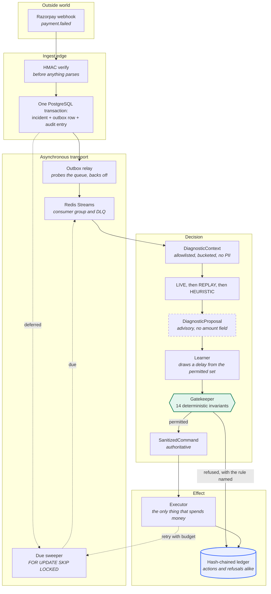
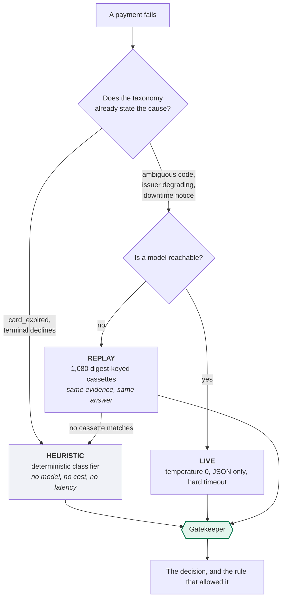
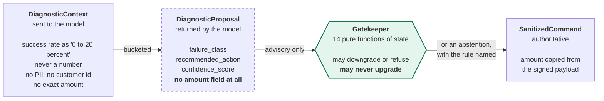

<div align="center">


# ResilientMesh

**A failed payment is a decision, not a retry.**

A recovery system that learns, bounded by rules that were checked exhaustively rather than
tested, writing down enough at the moment of each decision that anyone can later work out what
a *different* policy would have earned on the same traffic, without spending a rupee to find
out.

The model may say what it thinks went wrong and where it thinks the money is hiding. It may
never decide what happens next, never name an amount, and never move a rupee. Every action it
takes, and every action it refuses, comes out as a proof you can check without trusting the
system that produced it.

[](https://go.dev)
[](LICENSE)
[](#seq-4--gate_decision)
[](#the-fourteen-invariants)
[](#the-receipts)
[](#dependencies)

[](https://huggingface.co/spaces/hriday29/resilientmesh)

</div>

---

## This README does not ask you to believe it

Every number below carries the command that produces it and the observation that would prove it
false. Both live in [`docs/receipts.json`](docs/receipts.json), and one command re-runs the lot:

```bash
go run ./cmd/receipts        # about 60 seconds
```

```
5 verified, 0 failed, 3 left for the reader's own browser
every claim this can check still holds
```

If a figure here drifts from what the code does, that command fails, and so does
`./scripts/judge.sh`. A README is normally the one artefact in a repository that nothing
checks: numbers are pasted in once, the code moves, and the document quietly becomes a
description of a program that no longer exists. This project's entire argument is that a system
touching money should emit evidence rather than assurances, and it would be a strange argument
to abandon in the file that makes it.

Skip to [**the receipts**](#the-receipts) if that is the part you want to attack first.

---

## Why this, and not a sixth recovery agent

Razorpay's Agent Studio already ships Subscription Recovery, Revenue Drop Detector,
Auto-Capture, RTO Shielder and Dispute Auto Responder. Building a seventh variation of those
would be building the part that is already solved.

The unsolved part is the one that stops any of them from being shipped to a regulated Indian
merchant:

> "Your agent retried my customer's mandate. Prove it was allowed to, prove it did not change
> the amount, and show me the record. The one that would still be trustworthy if someone had
> database access."

A log line and a model's rationale do not answer that. Both are written by the same system that
took the action, and an LLM's explanation is a post-hoc narration, not a cause.

**ResilientMesh is the layer that makes shipping the first five defensible**, demonstrated on
the hardest case: RBI-regulated recurring mandate recovery, where a wrong retry is not a bad
outcome but a regulatory breach.

### Four ways to evaluate it

| | | |
|---|---|---|
| **Attack it** | **[the evidence page](https://huggingface.co/spaces/hriday29/resilientmesh)** | The real gatekeeper, compiled to WebAssembly. Send it proposals no model would produce and watch fourteen invariants refuse them, **in your browser**, with no server involved. |
| **Verify it** | same page | Re-derives all 1,112 audit digests, then proves one payment on its own with about ten sibling hashes instead of the whole ledger. Both run on your machine. |
| **Falsify it** | `go run ./cmd/receipts` | Re-runs every claim this document makes and exits non-zero if any of them has stopped being true. |
| **Run it** | `go run ./cmd/meshdemo` | The whole system, about three minutes. No Docker, no account, no key. |

[Evaluation guide](docs/EVALUATING.md)
·
[Post-mortem](docs/POSTMORTEM.md)
·
[Architecture](docs/ARCHITECTURE.md)
·
[Threat model](docs/THREAT_MODEL.md)

---

## Run it in one command

Go 1.25 or newer is the only prerequisite. No Docker, no cloud account, no payment credentials,
no API key.

```bash
git clone https://github.com/vighriday/ResilientMesh-Razorpaybuildathon
cd ResilientMesh-Razorpaybuildathon
go run ./cmd/meshdemo
```

That starts embedded PostgreSQL 18.3 and a Redis-protocol server **inside the process**, boots
the real API and worker, drives a scripted bank outage through them, and narrates what is
happening while every number is read back out of the database. It finishes in about three
minutes and writes a transcript to `artifacts/DEMO_REPORT.md`.

<details>
<summary><b>What that run actually prints</b> (the published run, verbatim, trimmed)</summary>

```
  1. A bank goes down and failed payments start arriving
     PAYMENT             ISSUER           DECLINE                  AMOUNT          STATE
     pay_XD0nBPG9aT3YHf  netbanking:SBIN  authentication_failed    ₹6,829.00     SCHEDULED
     pay_8GFsLzJwJTgUIN  netbanking:ICIC  insufficient_funds       ₹4,811.00     EXECUTING
     pay_bDEHVc295COswR  card:ICIC        gateway_technical_error  ₹1,52,574.00  SCHEDULED

  2. What the model proposes, and what the gatekeeper allows
       WEBHOOK_ACCEPTED     gateway_technical_error, ₹1,52,574.00, signature verified
       DIAGNOSIS_PROPOSED   HEURISTIC proposed ASYNC_EXPONENTIAL_RETRY at 0.60
       POLICY_DECISION      {"arm": "retry_after_6h", "cell": "issuer=card:ICIC|class=…
       GATE_DECISION        ASYNC_EXPONENTIAL_RETRY on card after 21600s
                            [AMOUNT_PINNED DELAY_BOUNDS]
       INCIDENT_SCHEDULED   deferred 21600s; the due time is written to the incident row

  3. The decisions it refuses to make
     INVARIANT             TIMES FIRED  WHAT IT PREVENTS
     TERMINAL_DECLINE      3            a decline no retry can fix, so no fee is spent
     AMOUNT_PINNED         1            the amount can only come from the signed payload
     DELAY_BOUNDS          1            the schedule stays inside a sane horizon
     RBI_AFA_CEILING       1            above the ceiling a debit needs authentication
     RBI_MANDATE_COOLING   1            RBI's 24-hour gap between recurring debits
     RBI_PRE_DEBIT_NOTICE  1            the payer must be warned before a debit

  5. The audit ledger, and an attack on it
  ✓ Chain intact: 1112 entries verified, head 364393aee287352e…
  ✓ Evidence pack for pay_ZQIVqcPE89To…: 11 entries provable in 21.5 kB
  · Editing entry 556 directly in PostgreSQL, as an attacker with database access would
  ✓ Detected at entry 556 — the exact row that was edited
```

</details>

<div align="center">

<br><em>The <a href="https://huggingface.co/spaces/hriday29/resilientmesh">evidence page</a> replays this run's own incidents through the real architecture. Each one branches at the gate the way it actually branched.</em>
</div>

---

## What is real, and what is simulated

Stated before anything else is claimed, because a recovery system that overstates its own
numbers has failed at the thing it exists to do.

| Real | Simulated |
|---|---|
| **The system.** Embedded PostgreSQL, Redis Streams, the outbox relay, the worker, the gatekeeper and the executor are the production code paths, not a demo build. | **The payments.** Traffic comes from a Razorpay simulator that serves Razorpay's schemas, signs real HMAC webhooks and emits real decline codes against real Indian issuer codes. No customer, and no rupee, is real. |
| **Every decision**, and the rule that permitted or refused it. | **Therefore every money figure is simulated money.** It is summed honestly from the `attempts` table, and it measures the policy rather than a merchant's actual revenue. |
| **The audit ledger** and its SHA-256 hash chain. | **The clock.** Waits before a scheduled retry are compressed by a factor of 240 so the loop closes while you watch. Regulatory delays are never compressed, and the factor is recorded in the ledger entry itself. |
| **Every count, amount and timestamp**, read from the running system's own database. | **The world the estimator is scored against.** `meshctl learn` generates a corpus whose latent structure is known, because scoring a counterfactual needs an answer key and production has none. The method and its accuracy are real; the traffic is not. |
| **The learning**: propensities are committed to the ledger before each attempt runs, and the worker chooses its delay through the same learner. | |

One more, because it is the kind of thing a README usually rounds in its own favour: **every
decision in the published run was made by the deterministic tier.** A model was configured, and
none of the 219 diagnoses reached it. That is the tier a reviewer with no API key gets, so it is
the honest one to publish. The live path exists, is exercised by the suite against 1,080
digest-keyed cassettes, and is described [below](#seq-2--diagnosis_proposed).

---

# `pay_XD0nBPG9aT3YHf`

Rather than a tour of the features, the rest of this document follows one real payment.

It is the first entry in the published ledger, it is on the
[evidence page](https://huggingface.co/spaces/hriday29/resilientmesh) right now, and its eleven
audit entries are the only table of contents here. Every mechanism worth describing is described
at the moment it actually bit.

> A netbanking payment of **₹6,829.00** through **SBI** failed with `authentication_failed`.

| Seq | Entry | Digest | What happened |
|---:|---|---|---|
| 1 | `WEBHOOK_ACCEPTED` | `4c4171ce` | [The signature was checked before the body was parsed](#seq-1--webhook_accepted) |
| 2 | `DIAGNOSIS_PROPOSED` | `b5b98532` | [Something advisory said what it thought had gone wrong](#seq-2--diagnosis_proposed) |
| 3 | `POLICY_DECISION` | `3a637f22` | [A delay was drawn, and the probability of drawing it was written down first](#seq-3--policy_decision) |
| 4 | `GATE_DECISION` | `498d0ea1` | [Fourteen invariants decided what was actually permitted](#seq-4--gate_decision) |
| 5 | `INCIDENT_SCHEDULED` | `3d50409f` | [The retry was deferred six hours, durably](#seq-5--incident_scheduled) |
| 474 | `DIAGNOSIS_PROPOSED` | `ffafb8fb` | [Hours later, on a different delivery, with nothing held in memory](#seq-474--the-gap) |
| 477 | `POLICY_DECISION` | `5b755b60` | [This time it exploited rather than explored, and said so](#seq-477--the-second-draw) |
| 480 | `GATE_DECISION` | `dfccb2a7` | The same fourteen functions, on the second attempt |
| 483 | `ATTEMPT_STARTED` | `011f13bf` | [The only component that spends money](#seq-483486--the-attempt) |
| 486 | `ATTEMPT_RESULT` | `d49d8a79` | Recovered. Fee: 250 paisa |
| 489 | `INCIDENT_CLOSED` | `cec71a89` | ₹6,829.00 recovered for ₹2.50 |

Each digest commits to the one before it. The eleven are scattered across a 1,112-entry ledger
holding 170 other payments, and [any one of them can be proved without disclosing the
rest](#and-then-proving-it-to-somebody-else).

---

## Seq 1 · `WEBHOOK_ACCEPTED`

```json
{"event": "payment.failed", "payment_id": "pay_XD0nBPG9aT3YHf",
 "issuer_key": "netbanking:SBIN", "error_code": "authentication_failed",
 "amount": 682900, "recurring": false}
```

`682900` is paisa. Money is an integer from this line to the end of the system, and floats are
banned from money paths.

The HMAC is verified with a constant-time compare **before anything parses the body**, with a
bounded timestamp skew in both directions so a captured delivery cannot be replayed
indefinitely. The incident row, the outbox row and this audit entry are written in **one
PostgreSQL transaction**, so there is no window in which the system has accepted a webhook it
has no record of.



---

## Seq 2 · `DIAGNOSIS_PROPOSED`

```json
{"mode": "HEURISTIC", "classification": "CUSTOMER_ACTION_REQUIRED",
 "action": "ASYNC_EXPONENTIAL_RETRY", "confidence": 0.66, "degraded": true,
 "root_cause": "authentication step was not completed on issuer netbanking:SBIN"}
```

Three tiers answer this question, and the entry names which one did.



`"mode": "HEURISTIC"` and `"degraded": true` are the system saying, in the permanent record,
that it answered without a model. A model **cannot forge that field**: provenance is carried on
struct fields tagged `json:"-"` and set in-process after the call returns, so a model replying
`{"mode":"LIVE"}` is replying with a field that is discarded before anything reads it.

### The boundary this sits on

It is structural rather than procedural. It is enforced by **which fields exist on which type**,
so it cannot be forgotten at a call site.



- A model **cannot change a sum**, because the proposal type has no amount field to carry one.
  Not a validated field. No field.
- A prompt-injected action string **cannot become a valid action**, because the parsers fold
  ASCII only. That last one was a real bug: `strings.ToUpper` applies *Unicode* case mapping, so
  `AſYNC_EXPONENTIAL_RETRY` parsed. See [what broke](#what-broke-and-what-i-did-about-it).

A model is **never** used for:

| Decision | Why not |
|---|---|
| Anything at all | The gatekeeper is 14 pure functions. Model output is an input to it, never a substitute for it. |
| Money | Amounts are copied from the signed payload. |
| Regulatory timing | RBI's cooling window and pre-debit notice are arithmetic on timestamps. A model that is 99 percent right about a legal minimum is 100 percent unusable. |
| Retry budgets and backoff | Bounded arithmetic, not judgment. |
| The ledger | Written by the code that acted, hashed by a function with no configuration. |
| Whether a proposed policy change is real | The model may say where to look. Whether the effect exists is decided by an estimator against data the model never influenced, at a confidence widened for the number of things being tested. |

---

## Seq 3 · `POLICY_DECISION`

This is the entry the rest of the project is built to make possible.

```json
{
  "cell": "issuer=netbanking:SBIN|class=CUSTOMER_ACTION_REQUIRED|hb=5|att=1",
  "arm": "retry_after_6h",
  "delay_seconds": 21600,
  "propensity": 0.32456,
  "distribution": {"retry_after_2h": 0.36592, "retry_after_6h": 0.32456, "retry_after_24h": 0.30952},
  "permitted": ["retry_after_24h", "retry_after_2h", "retry_after_6h"],
  "greedy_arm": "retry_after_24h",
  "explored": true,
  "honoured": true,
  "model_digest": "9628a8b9d9b456a4d8fe09297e4709f630eb0b8a30cb178e14505be1fbad3f94"
}
```

Exponential backoff with jitter is a convention borrowed from network retries. Issuer recovery
is a hazard function with structure in it, and a doubling rule does not know that.
[`internal/bandit`](internal/bandit/) holds a Beta posterior over the recovery probability of
each context and delay, and samples from it.

**Read the `permitted` array first.** Five minutes and thirty minutes are not merely unchosen.
They are **absent**. [`internal/tuner`](internal/tuner/) offers the learner only the delays at or
above the ceiling the deterministic policy engine had already computed, so a recurring debit
inside RBI's cooling window has exactly one arm and a terminal decline has none.

> Safe exploration, where **safe** is a property checked over 510,720 reachable states rather
> than a hyperparameter somebody tuned. No amount of exploration can produce an attempt the
> invariants would have refused, because the refused arms never entered the draw.

**Then read `propensity`.** Ordinary Thompson sampling draws once per arm and plays the winner,
so the probability it assigned to what it did is never known. Here the whole distribution is
materialised first and the action drawn from it, which makes the logged propensity **exact
rather than reconstructed**.

That number is in the hash chain, written **before the attempt ran**, and the chain fixes the
ordering. This is the load-bearing part. A propensity recovered after the results are known can
be adjusted until the answer flatters whoever is presenting it, and nothing in the numbers
reveals it. A metrics store can be backfilled; an entry that commits to its predecessor and is
committed to by the outcome further down the same chain cannot.

`explored: true` says this decision was spent on learning rather than on `greedy_arm`, and says
it rather than leaving it to be inferred. `model_digest` pins the exact belief state the draw
came from, so somebody who does not trust this presentation can re-derive it.

---

## Seq 4 · `GATE_DECISION`

```json
{"action": "ASYNC_EXPONENTIAL_RETRY", "attempt": 1, "target_rail": "netbanking",
 "delay_seconds": 21600, "proposal_mode": "HEURISTIC", "overrode_proposal": false,
 "applied_invariants": ["AMOUNT_PINNED", "DELAY_BOUNDS"]}
```

The proposal was advisory. This is the decision. Two invariants applied here; twelve others were
evaluated and had nothing to say about a non-recurring netbanking retry on attempt one. Had this
been a mandate, six more would have had opinions and one of them would have won.

### The fourteen invariants

Every one is a pure function of state, and every refusal is written to the ledger naming the
invariant that caused it.

| Invariant | What it prevents |
|---|---|
| `AMOUNT_PINNED` | The amount can only come from the signed payload |
| `TERMINAL_DECLINE` | A decline no retry can fix, so no fee is spent on it |
| `STOP_RULE_MAX_ATTEMPTS` | The per-incident retry ceiling |
| `LOW_CONFIDENCE_ABSTAIN` | The model was not sure enough to spend money |
| `UNRECOVERABLE_CLASS` | Retrying this class cannot help |
| `SESSION_REQUIRED_FOR_MORPH` | No live checkout to move, so no rail morph |
| `RAIL_ALLOWLIST` | The merchant never enabled that rail |
| `RBI_MANDATE_COOLING` | RBI's 24-hour gap between recurring debits |
| `RBI_PRE_DEBIT_NOTICE` | The payer must be warned before a debit |
| `RBI_AFA_CEILING` | Above ₹15,000 (₹1,00,000 for some categories) a debit needs a fresh authentication factor |
| `MANDATE_HALTED` | This mandate must not be debited again |
| `MANDATE_CYCLE_CAP` | Attempts allowed within one billing cycle |
| `INSTRUMENT_REFRESH_ALLOWED` | Re-present the token rather than the dead card |
| `DELAY_BOUNDS` | The schedule stays inside a sane horizon |

### Proof, not assertion

```
$ go run ./cmd/modelcheck

  abstract states     1612800
  reachable states    510720
  unreachable states  1102080 (proved unreachable from a fresh mandate)
  transitions         8390192
  digest              e47bc4971bc13d58831976759ac57c40023d6387eadf42a4f59339ada9a735f2

  [HOLDS ] AMOUNT_PINNED                 510720 checked   0 violations
  [HOLDS ] RECURRING_COOLING_AND_NOTICE  510720 checked   0 violations
  [HOLDS ] ATTEMPT_CAP                   510720 checked   0 violations
  [HOLDS ] AFA_CEILING                   510720 checked   0 violations
  [HOLDS ] CLOSED_ACTION_SET             510720 checked   0 violations
  [HOLDS ] REFRESH_PRESERVES_TERMS       510720 checked   0 violations
  [HOLDS ] EXECUTABLE_NAMES_A_RAIL       510720 checked   0 violations
  [HOLDS ] SCHEDULE_BOUNDED              510720 checked   0 violations
  [HOLDS ] GATE_DECIDES_WITHOUT_ERROR    510720 checked   0 violations

total violations 0
```

Property testing samples. **Model checking enumerates.** Where a property test can only say "no
counterexample in 20,000 draws", this says there is none. That distinction found two real bugs,
one of them an invariant that had been specified and never implemented.

The `digest` covers the enumerated space itself, which is why
[receipt R1](#the-receipts) checks it: a state space that quietly narrows would otherwise pass
with fewer states to check and nobody would see it.

### Attack this yourself, right now

`cmd/meshwasm` compiles this exact package to WebAssembly. It imports `internal/gatekeeper`
through `internal/gatewire` and adds nothing but JSON decoding, so there is no second
implementation to drift. Its clock comes from the request rather than the host, so the same
input gives the same decision on every machine.

<div align="center">

<br><em>The model asked for ₹49,999.00. The command came out ₹4,999.00, pinned from the signed payload, with the rule that did it named.</em>
</div>

Smuggle an amount into the JSON, spell an action with U+017F, claim a confidence of 1e9, debit a
mandate two hours into RBI's twenty-four hour cooling window. Then press **Re-derive every
decision**: the page replays eleven recorded inputs through the module in your browser and
compares every field against the answers the server build gave, including which invariants fired
and in what order. Two builds of one package agreeing, shown rather than claimed.

---

## Seq 5 · `INCIDENT_SCHEDULED`

```json
{"action": "ASYNC_EXPONENTIAL_RETRY", "rail": "netbanking", "delay_seconds": 21600,
 "execute_after": "2026-09-05T17:53:26Z",
 "demo_time_scale": 240, "demo_execute_after": "2026-09-05T11:54:56Z"}
```

Six hours, written to the incident row rather than held in a timer. The compression factor is in
the entry, next to the real due time it replaced, because a demonstration that silently speeds
up its own clock is lying at the exact point it most wants to be believed. Regulatory delays are
never compressed.

Getting here was the subject of two of the seventeen defects. Deferred recoveries were once
silently dropped, with a comment claiming a scheduler collected them and no scheduler existing,
so the ledger recorded correct decisions that never happened. Separately, a transient broker
outage permanently destroyed events, because the relay parked a row on its *first* publish
failure. Both were found by booting the whole thing rather than by testing its parts.

---

## Seq 474 · The gap

Ninety-five seconds of wall clock later, six hours of scheduled time, the sweeper picks the row
up with `FOR UPDATE SKIP LOCKED` and the incident goes round again. A **different** delivery, on
a worker that may have restarted in between.

```json
{"mode": "HEURISTIC", "classification": "CUSTOMER_ACTION_REQUIRED", "confidence": 0.66}
```

Identical evidence, identical answer. That is the deterministic tier being deterministic, and it
is what makes the third tier viable at all: 1,080 cassettes keyed by a digest of the evidence,
so a reviewer with no API key sees the same decisions rather than a degraded imitation of them.

**Nothing about the first decision was held in memory.** The learner needs to know which arm it
played hours ago in order to learn from this outcome, and rather than keep that in a process
that a restart would lose, it reads back the `POLICY_DECISION` entry that had to be written
anyway. The audit trail is not a side effect of the decision loop here. It is a component of it.

---

## Seq 477 · The second draw

```json
{"cell": "issuer=netbanking:SBIN|class=CUSTOMER_ACTION_REQUIRED|hb=5|att=2",
 "arm": "retry_after_24h", "propensity": 0.35840, "greedy_arm": "retry_after_24h",
 "explored": false, "honoured": true,
 "model_digest": "494300524da4913323c6229e2b7b3b3f9d81a324095ec4d386d8830aa2fa770b"}
```

Same payment, different cell: `att=2`. This time `arm` equals `greedy_arm` and `explored` is
`false`, so the draw landed on what the posterior currently favours. The digest has moved,
because the belief state has: everything the system learned in the intervening 471 entries is
folded into it.

`honoured: true` is the learner checking the gate's answer against its own. It is set by
comparing the delay the gate actually returned with the one that was offered, so a claim that
exploration stayed inside the invariants is a recorded observation rather than an architectural
assurance.

---

## Seq 483–486 · The attempt

```json
{"rail": "netbanking", "attempt": 2, "succeeded": true, "fee_paisa": 250, "error_code": ""}
```

The executor is the only component in the system that spends money, and it acts on a
`SanitizedCommand` rather than on a proposal. **₹6,829.00 recovered for ₹2.50.**

That ratio is the entire commercial argument, and it is also why `TERMINAL_DECLINE` fired
twenty-one times across the whole run: a fee spent retrying a card reported lost is a fee spent
turning a declined payment into a declined payment with a cost attached. The veto table further
up shows three, because it is a snapshot printed while incidents were still arriving.

---

## Seq 489 · `INCIDENT_CLOSED`

```json
{"state": "RECOVERED"}
```

Eleven entries. Two attempts. One recovered payment.

### And then proving it to somebody else

A hash chain makes the ledger tamper-evident, but checking a single entry against it means
walking every entry before it. So proving this one payment would mean handing over all 1,112
entries, which a merchant cannot do: they contain 170 other customers' payments.

[`internal/attest`](internal/attest/) adds a Merkle tree over the same entry digests the chain
links. An inclusion proof is about log2(n) sibling hashes, and the siblings are digests, so a
bundle proves its payment and discloses nothing about any other.

<div align="center">

<br><em>Eleven entries proved in 21.5 kB, with about ten sibling hashes each, without reading the other 1,101.</em>
</div>

```bash
go run ./cmd/meshctl evidence pay_XD0nBPG9aT3YHf --out dispute.json
```

That is the shape a merchant hands a bank during a **chargeback dispute**, and the shape a
compliance team hands an auditor asking whether a mandate debit was permitted. It is plain JSON
with the verification recipe written into it, because evidence that can only be checked by the
tool that produced it is not evidence. Two implementation details matter and are tested: leaves
and interior nodes carry different tags, following RFC 6962, so no leaf can impersonate an
interior node; and odd levels promote rather than duplicate, which is the shape CVE-2012-2459
exploited.

If the chain is already broken, `meshctl evidence` **refuses to emit anything** rather than
producing a bundle with a caveat. A valid-looking proof of membership in a compromised set is
worse than no proof.

### How the chain is built

Fields are absorbed **length-prefixed**, an 8-byte big-endian length then the bytes, rather than
concatenated, so an attacker who controls two adjacent fields cannot forge a collision by
shifting the boundary between them.

```go
h := sha256.New()
absorbUint(h, uint64(e.Seq))
absorbStr(h, e.IncidentID)
absorbStr(h, string(e.Kind))
absorbStr(h, e.Actor)
absorb(h, e.Detail)
absorbUint(h, uint64(e.At.UTC().UnixNano()))
absorbStr(h, e.PrevHash)
```

The demonstration attacks it. It edits entry **556**, in the middle of the chain, directly in
PostgreSQL as an attacker with database access would, and requires verification to localise the
break to that exact sequence number. A ledger that only catches a modified head catches nothing,
because the head is what an attacker rewrites last.

**You can check this without running anything.** The
[evidence page](https://huggingface.co/spaces/hriday29/resilientmesh) ships all 1,112 entries as
the exact bytes the ledger hashed, re-derives every digest with your browser's own
`crypto.subtle`, and gives you a button that plants a forgery so you can watch it fail.

---

# What one payment cannot tell you

`pay_XD0nBPG9aT3YHf` recovered on a 24-hour retry. **Would it have recovered on a two-hour
one?**

That question has no answer in the record above, and it has no answer in any production
payments log anywhere. The payment failed once, one action was taken, one outcome was observed,
and the outcomes of the actions not taken are gone.

Which is why every recovery number anyone quotes is unfalsifiable. "We recovered 34 percent"
measures the traffic mix as much as the policy, there is no held-out arm to compare against, and
the only way to find out whether a change is an improvement is to ship it to real customers and
watch. For a regulated Indian merchant that is not a trade anybody makes, so recovery policy
stays frozen at whatever exponential backoff someone wrote years ago.

The `propensity` field in entry 3 is what makes the question answerable.

## Estimating what a policy you never ran would have earned

With propensities, [`internal/ope`](internal/ope/) estimates the value of a *different* policy
from the log alone. Inverse propensity scoring, self-normalised IPS, and a doubly-robust form
backed by a cross-fitted reward model, each with a bias-corrected and accelerated bootstrap
interval. When the target policy puts mass where the logging policy could not go, it
[refuses](internal/ope/ope.go) rather than dividing by a small probability.

> "Give us last month's logs. We will tell you what this policy would have earned on your
> traffic, with a confidence interval, without touching a rupee."

The obvious objection is that nobody can check such a claim, because the counterfactual is
unobservable. That is true in production, and it is why every published off-policy result is an
argument from method rather than a measurement of accuracy.

[`internal/lab`](internal/lab/) removes the objection. It builds a world whose latent structure
is known, so the exact value of any policy is computable in closed form. The estimate is made
from the log with no access to that structure, and only afterwards is the answer key opened. The
gate in that world is the **real** `internal/gatekeeper`, so the arms it removes are the arms it
would remove in production.

<div align="center">

</div>

```bash
go run ./cmd/meshctl learn validate     # about 14 seconds, no database, no key
```

Read the bottom block last, because that is the order it happens in. The estimate says the
candidate is worth **890.2 paisa more per decision, somewhere between 455.8 and 1,221.0**. The
truth, which the estimator never saw, is **1,200.2**. Inside. Relative error on the value
itself: **-1.52 percent**.

The middle block is a separate claim, measured by running each policy over the same world with
the same pre-drawn outcomes: the learner recovers **30.9 percent against the fixed schedule's
23.8**, and **32 percent more net value**.

<div align="center">

<br><em>The same result on the <a href="https://huggingface.co/spaces/hriday29/resilientmesh">evidence page</a>. The band is what the estimator said from the log; the marker above it is what was actually true.</em>
</div>

Two of the seventeen defects live here, and they are the ones I would want a reviewer to read.
The first version self-normalised one side of a difference, where the estimator's bias stops
cancelling. The second used a percentile bootstrap on Indian ticket sizes, which span four
orders of magnitude and skew the bootstrap distribution hard enough that a symmetric interval
sits in the wrong **position** rather than merely being the wrong width. Coverage was near half
while every number on the screen looked respectable.

## Where a language model earns its place

A bandit optimises inside a feature space a person chose, and that choice goes stale: the
segment that matters this quarter belongs to a bank that moved its settlement window last month.
[`internal/mill`](internal/mill/) hands **that** job to a language model, and only that job.

It reads aggregated statistics and proposes segments worth testing. It never decides anything.
Every proposal is a typed segment from a closed grammar, and every one is scored by the
estimator against data the proposer did not influence.

<div align="center">

</div>

The world contains a rule nobody was told about: one bank clears its netbanking queue in an
overnight settlement batch, so a failure raised late in the evening recovers at 71 percent if the
retry waits six hours and 19 percent otherwise. It is in the outcome model and nowhere else. Not
in the features, the prompt, the backoff table or the gate.

The loop finds it, and **refutes five plausible decoys** on the way.

<div align="center">

<br><em>Refutations are published beside the survivors. A page showing only the winners would be indistinguishable from one that had been curated.</em>
</div>

Testing eight hypotheses at 95 percent confidence produces a false discovery roughly every other
round, and a system running nightly would assemble a policy made of noise inside a month. Every
interval is widened to **0.9938** so the chance of *any* false survivor stays at 5 percent. The
specificity is tested against a world built with the effect removed, where a hypothesis naming
that segment has to be refused, beside the same claim against the same world with the effect
present.

The prompt contains counts and rates over issuer keys, failure classes, hour blocks and delay
buckets. No payment, no amount, no customer, no free text that arrived in a webhook. There is
nothing in that conversation an attacker who controls a payload could have written, and the
worst a hallucinating model can achieve is to waste one significance test.

**The model proposes, the statistics dispose, the gate constrains, the ledger proves.** With no
API key the deterministic proposer answers instead, which is both the fallback and the control
that says how much the model is adding. The receipt for this round clears the model credentials
before running, so the number recorded here is the one a reviewer will get.

## And the number the gate was thresholding on

Look back at entry 2: `"confidence": 0.66`. The gatekeeper refuses any proposal below a
confidence floor, and that floor was a number someone chose. Every other rule here is derived or
exhaustively verified. [`internal/calib`](internal/calib/) closes the gap.

<div align="center">

</div>

It found a real defect. The recovery model is well calibrated in aggregate, and **badly
overconfident exactly where it is most confident**: a bin claiming 0.632 delivers 0.291, over 196
attempts. That matters because the number gets multiplied by a real amount to decide whether an
attempt is worth making. Isotonic regression, cross-fitted so the improvement is honest, takes
the error from **0.0105 to 0.0008** against a measured noise floor of **0.0035**.

The floor is not decoration. Expected calibration error is biased upward, so any correction
fitted against empirical frequencies appears to help; without a floor measured by bootstrapping
under a perfectly calibrated null at this exact sample size, the command would report a large
improvement on data that was already fine.

It also **declines to measure the inference tier**, and the reason is worth more than the number
would have been. See [what broke](#what-broke-and-what-i-did-about-it), defect 14.

---

# The receipts

Fourteen claims, each with the command that produces it and the observation that would prove it
false. Ten are here; the rest of the document's figures are quoted from the published run, which
ships with the page and is itself checkable.

```bash
go run ./cmd/receipts             # the fast tier, about 60 seconds
go run ./cmd/receipts -tier all   # everything a machine can check
go run ./cmd/receipts -only R2 -v # one claim, with the command's full output
```

| # | Claim | Check it with | Recorded | What would falsify it |
|---|---|---|---|---|
| **R1** | The invariants hold in every reachable state, not merely in every sampled one | `go run ./cmd/modelcheck` | 510,720 states, 8,390,192 transitions, 9 invariants, **0 violations**, digest `e47bc497…` | One violation anywhere, or a digest that moves while the gatekeeper is unchanged. The digest covers the enumerated space, so a silently narrowed state space fails here rather than passing with less to check. |
| **R2** | An off-policy estimate made from a log alone contains the true value of a policy that was never executed | `meshctl learn validate` | estimated lift **890.2**, true lift **1200.2**, both quantities inside their intervals, error **-1.52%** | The truth landing outside the interval. It is the one figure here that cannot be obtained on live traffic, because production has no answer key to open. |
| **R3** | A discovery round finds a rule nobody encoded and refutes the decoys beside it | `meshctl learn discover` | 8 tested at **0.9938**, **3 survived**, **5 refuted**, planted rule found | The planted rule going unfound, or a decoy surviving. Model credentials are cleared before this runs, so the recorded answer is the deterministic one a reviewer gets. |
| **R4** | The confidence the gate thresholds on is measured, and the defect that found is stated rather than corrected away | `meshctl learn calibrate` | ECE **0.0105**, worst bin **0.3413**, noise floor **0.0035**, after isotonic **0.0008** | The error falling below the noise floor, which would mean the reported defect was sampling noise all along. |
| **R5** | Nothing private is tracked in this repository | `go run ./cmd/leakscan` | **PASS**, 6 direct dependencies | Any credential shape, private-document path, dotenv value or control character in a tracked file. |
| **R6** | The suite is green, with nothing tagged out or quietly excluded | `go test ./... -count=1` | no `FAIL`, no build errors | Any failing package. The one defect this project knows about and has not fixed is reproduced by a command below rather than by a deleted test, so this staying green is not the same as nothing being wrong. |
| **R7** | The concurrent paths are race-free | `go test ./... -race -short` | no `DATA RACE` | A race report. Short mode skips the statistical experiments in `internal/lab` and `internal/mill`, which are single-goroutine arithmetic. It skips nothing that touches a goroutine. |
| **B1** | The gatekeeper in the page is the package the server imports, and agrees with it | *the page,* "Re-derive every decision" | 11 of 11 identical | Any field differing on any of the eleven. A Go process re-deriving these here would be the server build agreeing with itself, which is why this one is left to you. |
| **B2** | A real run's chain can be verified by someone who does not trust this codebase | *the page,* "Verify the chain" | 1,112 entries, in-browser | A digest that does not reproduce, or the forgery button failing to localise the break to the exact row. |
| **B3** | One payment can be proved on its own | *the page,* "Verify this payment on its own" | 11 entries, 21.5 kB | A bundle that needs the full ledger to check, or a forged entry passing. The forge button exists for the second. |

The three marked **B** are deliberately not automated. They are claims about what *your* machine
does with the published artefacts, and this repository asserting them would be precisely the
substitution the project exists to refuse. Each carries the reason in
[`docs/receipts.json`](docs/receipts.json) rather than being quietly omitted.

### Everything else, at once

```bash
./scripts/judge.sh          # every gate, with a written report in artifacts/
```

| Claim | How to check it | Result |
|---|---|---|
| It runs on a clean machine | `go run ./cmd/meshdemo` | boots in ~20 s from an empty database |
| It runs as a pass/fail gate | `go run ./cmd/meshctl selftest` | requires a *completed* recovery, then plants a tamper and requires detection at the exact row |
| It survives faults | `go run ./cmd/meshsim --seed 42 --chaos standard` | deterministic, byte-identical traces, 9 invariants checked |
| Coverage where it matters | `go test ./... -cover` | domain 98.3%, simulation 87.7%, attest 96.4% |
| This README is not lying | `go run ./cmd/receipts` | 5 verified, 0 failed, 3 for your browser |

### Dependencies

Six direct, all of them load-bearing:

| Module | Why |
|---|---|
| `jackc/pgx/v5` | PostgreSQL driver and pool |
| `redis/go-redis/v9` | Redis Streams consumer groups |
| `alicebob/miniredis/v2` | a real RESP server in-process, so managed mode needs no Redis |
| `fergusstrange/embedded-postgres` | real PostgreSQL 18.3 in-process, so managed mode needs no Docker |
| `google/uuid` | identifiers |
| `golang.org/x/time` | rate limiting |

There is one code path. Managed mode starts real PostgreSQL and a real RESP server and hands
back connection strings shaped exactly like the ones external mode takes from an operator, so
nothing downstream branches on how the infrastructure was started. **A demo path that diverges
from the production path proves nothing about the production path.**

---

## The system while it runs

`go run ./cmd/meshdemo -keep` leaves everything up. The operations console is read-only and
behind a per-run token. Every mutating action lives in `meshctl` behind an explicit `--yes`, and
writes its intent to the ledger *before* acting.

<div align="center">

<br><em>Live issuer health with circuit-breaker state, the inference-tier split, and the audit chain with its hashes.</em>
</div>

The checkout page exists for one reason: in-session rail morphing needs a live session to move,
and a session that only exists in a test is not evidence that the path works.

<div align="center">

<br><em>A live session against the running system. The rail track is what a morph moves, and the connection state is the SSE stream that carries it.</em>
</div>

---

## What broke, and what I did about it

Eighteen real defects, none of them found by reading the code. Full write-ups in
[docs/POSTMORTEM.md](docs/POSTMORTEM.md). One is **still open and left failing on purpose**.

The six newest all came from the same place: building a world with a known answer and counting
how often the estimator got it right. Every one of them produced output that looked entirely
reasonable.

| # | Found by | What it was |
|---|---|---|
| 1 | Exhaustive model checking | `RBI_AFA_CEILING` was specified and never implemented. A mandate above ₹15,000 would have been retried without a fresh authentication factor. `EXECUTABLE_NAMES_A_RAIL` failed at 29,952 states. **58,512 violations to 0.** |
| 2 | Reviewing consumers, not definitions | `Validate()` accepted `NaN` as a confidence score. Every ordered comparison against NaN is false, so `conf < floor` waved it through and downstream read it as *maximum* confidence. Four more fail-open contracts beside it. |
| 3 | Unicode case folding | `strings.ToUpper` applies *Unicode* case mapping, so U+017F (ſ) uppercases to ASCII S and `ParseAction("AſYNC_EXPONENTIAL_RETRY")` returned a valid action. These parsers sit directly on the model boundary. |
| 4 | Booting the whole thing | The offline path recovered nothing. Every unit test passed; the deterministic tier had no rule for soft declines, so a reviewer with no API key watched a recovery system recover nothing. |
| 5 | Booting the whole thing | Deferred recoveries were silently dropped. A comment claimed a scheduler would collect them. **There was no scheduler.** The ledger recorded correct decisions that never happened. |
| 6 | Deterministic simulation | A retried write double-counted money. The `attempts` table had an index on `(incident, attempt)` but no uniqueness, so a fault after `RecordAttempt` inserted a second row and inflated every measurement, in the direction that flatters the system. |
| 7 | Deterministic simulation | A transient broker outage permanently destroyed events. The relay parked a row on its *first* publish failure, and the claim itself charged an attempt. The relay's own comment stated the correct principle and the code did the opposite. |
| 8 | Running the demo twice | The demonstration poisoned its own next run: act 5 forges a ledger row and does not repair it, and the next run inherited that forgery through a reused data directory. Fixed by giving the demo its own database and emptying it every run. Adding a repair path for one's own audit trail would have been the wrong fix. |
| 9 | Recorded vectors | A conformance vector used `card_stolen`, which is not in the taxonomy, so it fell through to a generic retry and looked like the gate permitting a stolen card. The code is `card_lost_or_stolen`. The fixture was wrong, not the gate, and it was legible only because the expected answer is recorded from a real run rather than asserted by hand. |
| 10 | Running the harness twice | The race gate failed once and passed on a re-run, which is worse than failing: a reviewer who hits it thinks the project is broken and one who does not never learns. A real unsynchronised read in a test helper, reading `cap.bodies[0]` without the mutex the handler writes under. Passed in isolation eight times; the detector was right. |
| 11 | Counting coverage against a known answer | The lift estimator self-normalised one side of a difference. SNIPS is the right choice for a level and the wrong one for a difference: it divides the weighted term by the realised weight mass and leaves the subtracted mean undivided, so its bias no longer cancels, and on a small segment that residual is the same size as the effect. Intervals covered the truth about three quarters of the time while looking perfectly respectable. |
| 12 | Counting coverage against a known answer | The percentile bootstrap misplaced its interval on skewed data. Indian ticket sizes span four orders of magnitude, so a handful of large recoveries make the bootstrap distribution lean hard, and a symmetric percentile interval is put in the wrong *position* rather than merely being the wrong width. Coverage was near half. Fixed with a bias-corrected and accelerated interval, which needed a leave-one-out jackknife and therefore an inverse normal CDF. |
| 13 | Measuring before concluding | I wrote up "doubly-robust estimation makes this worse" as a finding, on the strength of one run against a small corpus where the reward model had no skill and the residual it subtracted was pure noise. Measured across corpus sizes it covers better at **every** one of them. The estimator was fine; publishing a finding before measuring it across the range was not. The table it should have been checked against is now in the package documentation and in a test. |
| 14 | Reading my own output sceptically | The calibration command reported the inference tier as wildly overconfident, right 33 percent of the time while claiming 74. The label was mine and it was wrong: a `payment_timed_out` raised during a confirmed issuer outage really is an outage, and the recorded proposals classify it that way about 80 percent of the time. I had scored the model against a ground truth I invented. The command now measures nothing there and explains why, which is worth more than the number would have been. |
| 15 | A hypothesis that should have survived and did not | Candidate policies were scored against the fixed backoff schedule rather than against the policy that produced the log. A proposal is a *change to what is deployed*, so scoring it any other way measures the difference between two whole policies and drowns the segment in it. A correct hypothesis about a real effect came back confidently negative. |
| 16 | A test failing, and being right | The null hypothesis in my own multiple-comparison test was not null. Permuting outcomes across a real log removes the covariance between weight and reward, which is the intent, and leaves a finite-sample offset of `(mean(w) - 1) * mean(r)` untouched while narrowing the interval that was resampling that covariance. It admitted three false discoveries in four rounds. The correction was fine; the null was not. Replaced with a world generated with the effect flattened. I nearly weakened the correction to make it pass. |
| 17 | **OPEN** | The reconciler amplifies during an outage: a parked outbox row is not `PENDING`, so the reconciler treats its incident as stalled and inserts a replacement, which parks too. 20,434 rows from 400 incidents. **Two fixes were attempted and both reverted.** One traded a loud failure for a silent one; the other stopped the run draining for reasons I did not fully characterise. A verification harness edited until it agrees with the system is not a harness, and a fix I cannot explain is not a fix. |
| 18 | Running the harness on a slower configuration | A test budgeted in frames for something measured in seconds. `TestHandlerServesManyConcurrentStreams` skips heartbeat comments to reach a data frame and gave up after thirty-two of them; under the race detector, sixty-four contending streams on a thirty-millisecond heartbeat put more than thirty-two comments ahead of the event, and six healthy connections were reported as broken. Raising the constant moves the threshold rather than removing it, so the budget is now a deadline, which is the unit the thing being waited for is measured in. Two smaller defects underneath: the readers called `t.Fatal` from spawned goroutines, printing one cause as six failures, and `judge.sh` showed the first fifteen lines of a failing gate, which for `go test ./...` is fifteen lines of `ok` with the cause cut off below. The same bet turned up again in `internal/agent`, where a test asserting that the API key is never logged gave its client a two-second timeout; that one I fixed on a diagnosis rather than a reproduction, and the post-mortem says so. |

Reproduce the open one:

```bash
go run ./cmd/meshsim --seed 20260904 --incidents 400
# invariant NO_EVENT_LOST violated: 20434 outbox rows exhausted their
# publish budget and were dead-lettered
```

---

## Security

The bar was: nothing internal reaches GitHub, and nothing internal reaches a user.

- **Webhooks** are HMAC-verified with a constant-time compare **before anything parses the
  body**, with a bounded timestamp skew in both directions so a captured delivery cannot be
  replayed indefinitely.
- **The model boundary** is enforced by types rather than by prompt wording. See
  [seq 2](#seq-2--diagnosis_proposed).
- **Money** is integer paisa end to end. Floats are banned from money paths.
- **The operations console** is read-only and behind a per-run token. Every mutation lives in
  `meshctl` behind `--yes`, and writes its intent to the ledger *before* acting.
- **The web UI** is CSP-strict and writes through `textContent` only, never `innerHTML`.
- **`cmd/leakscan`** is a committed scanner, run in CI over every tracked file: credential
  shapes, private-document paths, `.env` values, and control characters in tracked text. Test
  fixtures compose credential-shaped strings at runtime (`internal/testsecret`) so no tracked
  file contains a literal matching a scanner pattern, and no scanner exemptions are needed.
- **The exported run** is scrubbed of every secret before it is written, and the writer
  **refuses to write the file at all** if a secret survives redaction.
- **`.env` loading** accepts `MESH_`-prefixed names only, so a dotfile that lands in a checkout
  cannot set `PATH` or `LD_PRELOAD`.

---

## Repository layout

```
cmd/
  meshdemo     the guided demonstration; start here
  mesh         the whole system in one process
  meshctl      operator CLI: selftest, audit verify, evidence, learn, dlq replay
  modelcheck   exhaustive state-space walk over the gatekeeper
  meshsim      deterministic simulation with fault injection
  meshwasm     the gatekeeper, compiled to WebAssembly for the page
  leakscan     the secret and private-document scanner CI runs
  receipts     re-runs every claim in this README and fails if one has drifted
  api, worker, simulator
internal/
  domain       frozen contracts: taxonomy, decisions, records, hashing
  gatekeeper   the 14 invariants
  agent        the three inference tiers
  ingest       the webhook trust boundary
  outbox       transactional outbox relay
  queue        Redis Streams consumer group and DLQ
  worker       the decision loop, sweeper and executor wiring
  store        PostgreSQL, migrations, hash-chain allocation
  audit        the ledger
  attest       Merkle tree, inclusion proofs, portable evidence
  gatewire     the JSON boundary both the browser and the server call
  infra        embedded PostgreSQL and RESP, for managed mode
  simulation   the deterministic simulator and its invariants

  the learning layer
  bandit       Thompson sampling; the propensity is exact, not estimated
  tuner        the delay vocabulary, and what the gate leaves to choose from
  ope          IPS, SNIPS, doubly-robust, and a refusal when overlap fails
  reward       cross-fitted recovery model behind the doubly-robust term
  calib        expected calibration error, isotonic repair, the noise floor
  lab          a world with a known answer, so the estimator can be scored
  mill         the model proposes segments; the estimator refutes them
space/         the published evidence page
docs/          EVALUATING, POSTMORTEM, ARCHITECTURE, THREAT_MODEL, receipts.json
eval/          the four-policy benchmark
```

---

## Submission

| | |
|---|---|
| **Name** | Hriday Vig |
| **College** | Maharaja Surajmal Institute of Technology |
| **Graduating** | 2028 |
| **Track** | Track 03, AI Revenue Recovery |
| **Project** | ResilientMesh |
| **What it solves** | Failed payments in India are recovered today by blind retries that burn gateway fees, annoy customers, and on recurring mandates can breach RBI's e-mandate rules. ResilientMesh decides each failure on evidence, refuses the ones no retry can fix, obeys the regulatory constraints as hard invariants rather than as prompt instructions, and leaves a tamper-evident record of every decision including the refusals. It then learns a better schedule inside those constraints, and records enough at each decision that the value of a policy change can be estimated from the log before anyone risks a rupee on it. |
| **Repository** | https://github.com/vighriday/ResilientMesh-Razorpaybuildathon |
| **Evidence page** | https://huggingface.co/spaces/hriday29/resilientmesh |
| **Pitch video** | *(to be added)* |

**On how it was built.** This is heavily AI assisted, and saying so plainly is cheaper than
having it inferred. The problem selection, the architecture, the decision about which things the
model is structurally forbidden from touching, and the judgement about when a result that looked
right needed checking anyway, are mine. Six of the seventeen defects above were found by
distrusting output that looked correct, which is the only part of this that does not scale by
generating more of it.

---

<div align="center">

### [Open the evidence page](https://huggingface.co/spaces/hriday29/resilientmesh)

Verify a real run's audit ledger in your own browser. Nothing to install, nothing to trust.

<br>

### Anyone can make an agent act.

### The hard part is proving, afterwards, that it was allowed to.

<br>

**`go run ./cmd/meshdemo`**

Three minutes. No account, no key, no Docker.

Or open the [evidence page](https://huggingface.co/spaces/hriday29/resilientmesh) and try to talk
the gatekeeper into moving money. It is the real one.

</div>
