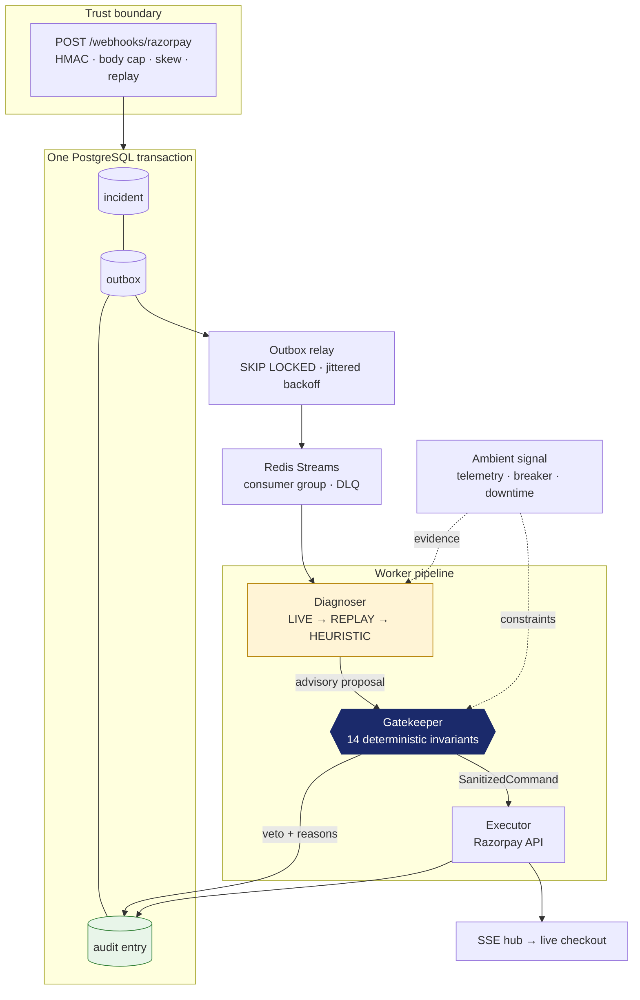
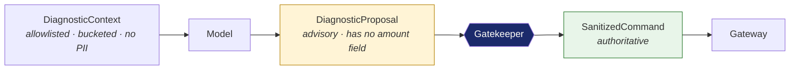
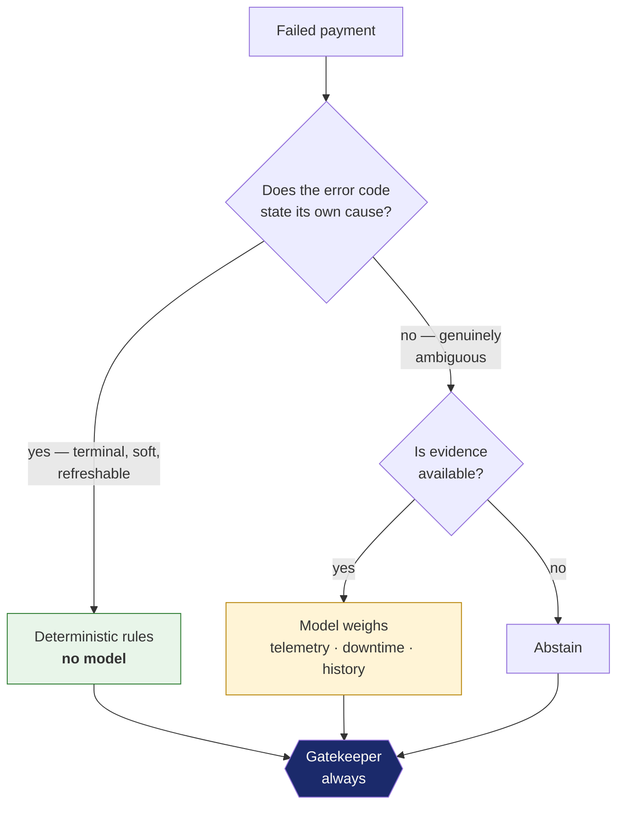

# ResilientMesh

**A deterministic control plane for agents that spend merchant money.**

Razorpay Buildathon — **Track 03, AI Revenue Recovery**

| | |
|---|---|
| **Built by** | Hriday Vig |
| **College** | Maharaja Surajmal Institute of Technology |
| **Graduating** | 2028 |
| **Track** | Track 03 — AI Revenue Recovery |
| **Repository** | `https://github.com/<your-handle>/razorpay-resilient-mesh` *(public)* |
| **Pitch video** | *(5 min, unlisted — link added at submission)* |

---

## The one-line version

Razorpay's Agent Studio already ships agents that act on merchant money — Subscription Recovery, Auto-Capture, RTO Shielder, Dispute Auto Responder. **ResilientMesh is not a sixth agent. It is the layer that makes shipping the first five defensible**: a deterministic gatekeeper the model cannot talk its way past, a tamper-evident ledger of every decision, and a proof — not a claim — that the rules hold.

It is demonstrated on the hardest case in the track: recovering failed payments and recurring mandates under RBI's e-mandate rules, where a wrong retry is not a suboptimal choice but a regulatory breach.

---

## Run it

One command. No Docker, no database install, no API key, no account, no spend, no network.

```bash
go run ./cmd/mesh
```

That boots a real PostgreSQL 18.3, a real Redis-protocol server, the HTTP edge, the worker pool and a Razorpay API simulator — all in one process — then drives a scripted bank outage through it. It prints the URLs and the operator token:

```
────────────────────────────────────────────────────────────────────
  ResilientMesh is running. Everything below is local.
────────────────────────────────────────────────────────────────────
  Checkout        http://127.0.0.1:8080/checkout.html
  Ops console     http://127.0.0.1:8080/console.html
  Razorpay API    http://127.0.0.1:8081
  Health          http://127.0.0.1:8080/readyz
────────────────────────────────────────────────────────────────────
  Ops token       d3cf8cf1e0611959e921eced46be19dd…
                  (generated for this run; paste it into the console)
────────────────────────────────────────────────────────────────────
  Scenario        issuer-outage, seed 42, 122 scripted failures
  Inference       HEURISTIC then REPLAY (no model configured)
────────────────────────────────────────────────────────────────────
```

| URL | What you see |
|---|---|
| `/checkout.html` | A live checkout. It moves from Netbanking to UPI mid-session, over SSE, when the bank degrades — before the customer gives up. |
| `/console.html` | Incidents, issuer health, breaker states, inference-tier mix, and the audit chain with a **Verify** button. |

First run downloads a PostgreSQL binary once (~60 MB) and caches it under your user cache directory. Cold start measured at **11.8 s**; warm start is a couple of seconds.

**Nothing binds beyond loopback.** No firewall prompt, no exposure.

### Verify it the way a reviewer would

```bash
./scripts/judge.sh          # or: powershell -File scripts/judge.ps1
go run ./cmd/modelcheck     # exhaustive proof over the decision state space
go run ./cmd/leakscan       # secret / private-material scanner over tracked files
```

---

## Why this, and not another retry bot

Every incumbent — Stripe Smart Retries, Adyen RevenueAccelerate, Juspay, Razorpay Optimizer — decides **before** the customer sees a failure: route the payment well, then statistically guess when to retry what failed.

ResilientMesh owns the part nobody owns: **the failure domain**, the seconds and hours *after* a decline.

Two things fall out of that, and both are only possible on Razorpay:

1. **Razorpay publishes issuer downtime.** `/v1/downtimes` moves an entity to `resolved` when the issuer recovers. Every competitor *estimates* that moment because their processors do not tell them. Waiting out a statistical guess about an event that is being broadcast is strictly worse than subscribing to the broadcast. Here, computed backoff is an **upper bound**; the resolution notice is the **mechanism**.

2. **`card_expired` is not terminal.** RBI card-on-file tokenization means recurring card payments in this market already run on network tokens. The card number changing does not mean the funding account went away. Classifying that decline terminal — as the industry does — silently discards recoverable revenue. ResilientMesh re-presents through the token instead.

---

## Architecture



**The incident, its outbox row and its audit entry are written in one transaction.** That is what removes the dual-write window in which a payment has been recovered and nobody has been told — the window where money goes missing.

### The trust boundary in one picture



The proposal type **has no amount field**. Not a validated one — no field at all. A model cannot propose a different amount because the wire format gives it nowhere to write one. The amount on the executed command is copied from the HMAC-verified webhook payload and nothing else, and that is an invariant proved exhaustively, not a code review comment.

Provenance (`mode`, `model`, `latency`, `degraded`) carries `json:"-"`. A model returning `{"mode":"LIVE"}` cannot promote its own answer to a higher tier in the audit trail.

---

## AI judgment: where the model is, and where it deliberately is not

This is the criterion the project is organised around.



**Where a model is not used, and why:**

- **Terminal declines** (`card_lost_or_stolen`, `bank_account_invalid`, …). The code states the cause. Asking a model is spending latency and money to be told what the taxonomy already says.
- **Soft declines** (`insufficient_funds`, `upi_collect_expired`, `invalid_otp`). Recoverable *and* unambiguous. The only open question is *when* to come back, and that is a function of who has to act: an OTP failure needs the payer to read a message (minutes); an empty balance needs money to arrive (six hours, crossing a salary credit). A model adds variance to a decision a lookup table gets right.
- **Every regulatory rule.** RBI's 24-hour cooling window, the pre-debit notice, the per-cycle attempt cap, the ₹15,000 / ₹1,00,000 additional-factor ceilings. These are deterministic invariants. A probabilistic component near them would be the defect.
- **Every money value.** Integers in paisa, copied from the verified payload. Floats are absent from money paths by construction.

**Where the model earns its place:** the ambiguous set — `bank_technical_error`, `gateway_technical_error`, `payment_timed_out`, `issuer_down`, `upi_psp_error`. Codes where the root cause is genuinely underdetermined and the answer depends on weighing rolling telemetry against portfolio baselines, downtime notices, breaker state and recent history. That is a judgement, and it is the only place one is made.

**Three inference tiers, so the system never depends on a model being reachable:**

| Tier | When | Provenance |
|---|---|---|
| `LIVE` | An API key is configured | Model + latency recorded per incident |
| `REPLAY` | 1,080 cassettes keyed by a digest of the *bucketed* context | Byte-identical decisions offline |
| `HEURISTIC` | Always available, last resort | Marked `degraded` in the ledger and in every benchmark |

A judge with no API key sees the same decisions as one with a live model, and the audit trail always says which tier decided.

---

## Build quality: what is actually proved

| Evidence | Result |
|---|---|
| Exhaustive model check over the mandate state space | **510,720 reachable states · 8,390,192 transitions · 9 invariants · 0 violations** |
| Property tests over the gatekeeper | 20,000 randomised inputs, 40,000 `Decide` calls, adversarial corpus |
| Deterministic simulation (virtual clock, seeded scheduler, fault injection) | Byte-identical traces from a seed |
| Race detector | Clean across every concurrent package |
| Test suite | 603 test functions · 20,488 lines of tests against 28,092 lines of code |
| Secret / private-material scanner | 7 checks, runs in CI, blocks the commit |
| Direct dependencies | **6** — pgx, go-redis, miniredis, embedded-postgres, uuid, x/time. No ORM, no web framework, no metrics library |

The model checker is the point. Property testing samples; this enumerates. Where a property test can say only *"no counterexample in 20,000 draws"*, the model checker says **there is none**, and prints a digest so a change in the gate's behaviour cannot pass unnoticed.

### The 14 invariants the gatekeeper enforces

`AMOUNT_PINNED` · `TERMINAL_DECLINE` · `STOP_RULE_MAX_ATTEMPTS` · `LOW_CONFIDENCE_ABSTAIN` · `UNRECOVERABLE_CLASS` · `SESSION_REQUIRED_FOR_MORPH` · `RAIL_ALLOWLIST` · `RBI_MANDATE_COOLING` · `RBI_PRE_DEBIT_NOTICE` · `RBI_AFA_CEILING` · `MANDATE_HALTED` · `MANDATE_CYCLE_CAP` · `INSTRUMENT_REFRESH_ALLOWED` · `DELAY_BOUNDS`

Every one that fires is written to the ledger with its reason. The console shows them per incident. **An abstention is recorded as carefully as an action** — a recovery system that logs only its successes cannot be audited.

---

## Failure recovery: what broke, and what I did about it

Not a list of bugs. The interesting ones are where the *method* found what review would not have.

**1. The model checker found two defects that 20,000 property-test cases missed.**
`RBI_AFA_CEILING` was specified and never implemented — a recurring debit above ₹15,000 would have been retried without an additional factor, which is a regulatory breach, not a suboptimal choice. And `EXECUTABLE_NAMES_A_RAIL` failed at **29,952 states**: the gatekeeper carried its own local notion of which actions execute, that notion predated the instrument-refresh action, so `DELAY_BOUNDS` cleared the rail the refresh rule had just set and the gate emitted an executable command naming no rail. The property test missed both because the corpus never generated a refresh. Fixed by deriving the predicate from the domain type — the class of bug, not the instance — then extending the corpus. **58,512 violations → 0.**

**2. Five fail-open defects in my own frozen contracts, found by the packages consuming them.**
The worst: `Validate()` accepted `NaN` as a confidence score. Every ordered comparison against `NaN` is false, so `conf < floor` waved it straight through and a `NaN` read as maximum confidence. The fix is written as a positive assertion — `!(conf >= floor && conf <= 1)` — because the negative form is the bug. Also: `Recoverable()` defaulted to `true` (a new failure class would have become retryable by omission); provenance fields had live JSON tags, so a model could forge its own tier; `Degraded()` was blind when the baseline was zero.

**3. The offline path recovered nothing, and only an end-to-end run showed it.**
Every unit test passed. Booting the whole system revealed **every incident abstaining**: the heuristic tier had no rule for the ambiguous or soft codes, so with no API key the system diagnosed 12 incidents and acted on one. Unit tests could not see it because each component was individually correct. Fixed by giving the deterministic tier the codes whose cause the taxonomy already states — which is also the honest boundary described above.

**4. A test that passed for the wrong reason.**
`miniredis` never ages pending-entry idle time, so a queue-reclaim test was passing without exercising reclaim at all. I rewrote it honestly against `MinIdle=0` and documented the fake server's limitation rather than keeping a green tick. Finding it exposed a real API bug next door: `minIdle <= 0` collapsed *"use the default"* with *"claim regardless of idle time"*, making zero unreachable.

**5. Path traversal into the gateway URL.**
`url.PathEscape` was insufficient because the HTTP client re-parses the URL and traversal segments survive re-parsing. Replaced with a strict allowlist on the identifier itself.

**6. An IDOR in the source design's own event stream.**
The plan called for `/stream/{order_id}`. Order ids are guessable and routinely shared, so that streams a stranger's recovery progress to anyone who can iterate. Changed to an opaque session id plus a single-purpose bearer token, stored only as a hash, compared in constant time — recorded as ADR-011.

**7. The race detector did not work, and the honest fix was to say so.**
`gcc` on `PATH` was 32-bit MinGW. `scripts/judge.ps1` now resolves a working 64-bit toolchain and **reports plainly when none exists** rather than quietly running without `-race`. A green suite that silently skipped the race detector is worse than a red one.

---

## Security

Highest weight in this build. Full model in [`docs/THREAT_MODEL.md`](docs/THREAT_MODEL.md).

**Trust boundary.** Webhook order is the design: body cap → HMAC verify (constant-time, rotation window) → parse → skew → taxonomy → admission control → transaction. Parsing before verifying would mean parsing attacker-controlled bytes.

**The model is never trusted.** It receives an allowlisted, bucketed context with no PII. It returns a proposal with no amount field. The gatekeeper is authoritative. Prompt-injection attempts are in the test corpus, including reasoning traces that impersonate the decision format.

**Audit ledger.** Hash-chained with **length-prefixed field absorption**. Naive concatenation lets an attacker who controls two adjacent fields forge a colliding entry by shifting the boundary between them. Sequence and previous-hash allocation is serialised with a transaction-scoped advisory lock, so concurrent writers cannot fork the chain. Verification recomputes every link; it never compares a stored hash to itself.

**Nothing private is publishable.** `cmd/leakscan` runs in CI over every tracked file: private-path, credential shape, private references, `.env.example` hygiene, DOM-sink usage, dependency allowlist, control characters. Planning documents, strategy notes and the source brief live in a git-ignored directory and are **not in this repository**.

Test fixtures that need credential shapes **compose them at run time** via `internal/testsecret`. The usual escape — teaching the scanner to skip test files — would exempt the files most likely to hold a pasted-in key, and a scanner with that exemption is not a scanner.

**Web surface.** Strict CSP, no `unsafe-inline`, no CDN, no external font. Every value rendered with `textContent`; `innerHTML` appears nowhere. Ops surfaces behind a bearer token compared in constant time, including `/metrics` — an open metrics endpoint leaks issuer names, volumes and failure rates.

---

## Repository map

| Path | What lives there |
|---|---|
| `internal/domain/` | Frozen contracts: wire types, taxonomy, the trust-boundary types |
| `internal/gatekeeper/` | The 14 invariants — the authoritative decision |
| `internal/agent/` | Three-tier inference, context digest, prompt construction |
| `internal/worker/` | The recovery pipeline |
| `internal/store/`, `internal/audit/` | Transactional outbox, hash-chained ledger |
| `internal/queue/`, `internal/outbox/` | Redis Streams, DLQ, relay |
| `internal/modelcheck/` | Exhaustive state-space proof |
| `internal/simulation/` | Deterministic simulation testing |
| `internal/simulator/` | Razorpay API simulator |
| `internal/app/` | The single composition root the three binaries share |
| `cmd/mesh` | One-command everything |
| `cmd/api`, `cmd/worker` | Split deployment |
| `cmd/modelcheck`, `cmd/meshsim`, `cmd/leakscan` | Verification tooling |
| `eval/` | Offline benchmark: four policies, paired bootstrap, attestation manifest |
| `docs/` | Architecture, threat model, runbook, SLOs, data handling |
| `decisions.md` | Architecture decision records |

---

## Documentation

- [`docs/ARCHITECTURE.md`](docs/ARCHITECTURE.md) — components, data flow, failure domains
- [`docs/THREAT_MODEL.md`](docs/THREAT_MODEL.md) — assets, adversaries, controls
- [`docs/RUNBOOK.md`](docs/RUNBOOK.md) — operator procedures
- [`docs/SLO.md`](docs/SLO.md) — objectives and error budgets
- [`docs/DATA.md`](docs/DATA.md) — what is stored, what never is
- [`decisions.md`](decisions.md) — ADRs, including the ones that changed the design
